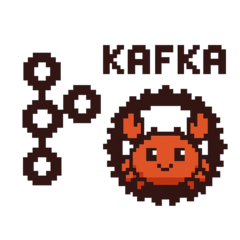

<div align="center">
  

# kacrab

**A Rust-native Apache Kafka client for producer, consumer, and admin use cases,
built from the Kafka protocol up. It is not a `librdkafka` wrapper.**

[![CI][ci-badge]][ci-url]
[![crates.io][crates-badge]][crates-url]
[![docs.rs][docs-badge]][docs-url]
[![MSRV][msrv-badge]][msrv-url]
[![MIT licensed][mit-badge]][mit-url]
[![Apache-2.0 licensed][apache-badge]][apache-url]

</div>

[ci-badge]: https://github.com/pirumu/kacrab/actions/workflows/ci.yml/badge.svg?branch=master
[ci-url]: https://github.com/pirumu/kacrab/actions/workflows/ci.yml
[crates-badge]: https://img.shields.io/crates/v/kacrab.svg
[crates-url]: https://crates.io/crates/kacrab
[docs-badge]: https://docs.rs/kacrab/badge.svg
[docs-url]: https://docs.rs/kacrab
[msrv-badge]: https://img.shields.io/crates/msrv/kacrab.svg
[msrv-url]: https://crates.io/crates/kacrab
[mit-badge]: https://img.shields.io/badge/license-MIT-blue.svg
[mit-url]: LICENSE-MIT
[apache-badge]: https://img.shields.io/badge/license-Apache--2.0-blue.svg
[apache-url]: LICENSE-APACHE

## Highlights

- **Designed to feel familiar if you know the Java client**: auth, producer,
  admin, and consumer follow Kafka property names, defaults, protocol flow, and
  wire semantics. The config keys you already know from the Java client work
  here too.
- **Producer**: batching, linger, bounded memory, compression
  (`gzip`/`snappy`/`lz4`/`zstd`), murmur2 + sticky/adaptive partitioning,
  multi-broker dispatch with failover on leadership changes, transactions, and
  a Kafka-faithful idempotent path (per-partition multi-in-flight, ordered
  retry, deferred epoch bump, sequence wraparound). Interceptors and
  Kafka-named metrics are included.
- **Consumer**: full Apache Kafka 4.3.0 feature parity: manual assignment,
  topic and pattern (regex) subscription, classic groups
  (`range`/`roundrobin`/`sticky` eager + incremental `cooperative-sticky`,
  KIP-429) and the KIP-848 server-side protocol; topic-id-keyed fetch
  (KIP-516, up to v18), incremental fetch sessions (KIP-227), truncation
  detection (KIP-320), `commit_sync`/`commit_async`/auto-commit, background
  heartbeat, static membership, typed deserializers, interceptors, and
  `metrics()`.
- **Admin**: the full Apache Kafka 4.3.0 `Admin` surface (62 operations):
  topics, configs (incremental), ACLs, groups & offsets, transactions,
  delegation tokens, quotas, SCRAM, reassignments, KRaft quorum, and the 4.x
  share/streams group families.
- **Auth**: `PLAINTEXT`/`SSL`/`SASL_PLAINTEXT`/`SASL_SSL`; SASL `PLAIN`,
  `SCRAM-SHA-256/512`, `OAUTHBEARER`, feature-gated `GSSAPI`; PEM/JKS/PKCS12
  stores and mutual TLS; native Rust custom-authenticator hooks. Handshake and
  auth failures fail fast with the broker's reason, matching Java.
- **Fast and lean**: on the same broker and defaults, producer throughput is
  **+25-28%** over Java with about 4x less memory; consumer throughput is
  **1.9-4x** higher with about 16-20x less memory. See
  [Benchmarks](#benchmarks).
- **Native Rust**: protocol, wire, and client logic are pure Rust, and the
  workspace forbids `unsafe_code`. Caveat: the default TLS provider
  (`rustls` + `aws-lc-rs`) uses C/assembly, and the optional `zstd`, `lz4-hc`,
  and `gssapi` features add C. For a C-free build, use a pure-Rust `rustls`
  provider and the `gzip`/`snappy`/`lz4` codecs.
- **Generated protocol**: request/response structs are generated from Apache
  Kafka schemas and checked byte-for-byte against the Kafka Java client oracle.
- **Verified with real brokers**: every client surface (producer, consumer,
  admin, every SASL mechanism and TLS mode, every compression codec, 3-broker
  failover) is verified end-to-end against real Apache Kafka 4.3.0 brokers.

## Documentation

- **[Design & Internals book](https://pirumu.github.io/kacrab/)**: architecture
  and deeper implementation notes: idempotent producer state machine, consumer
  rebalancing and fetching, SASL/TLS handshakes, protocol codegen, and benchmark
  methodology. Source lives in [`docs-book/`](docs-book/).
- **API reference**: [docs.rs/kacrab](https://docs.rs/kacrab).

## Status

Protocol, wire, auth, producer, consumer, and admin all have a verified usable
baseline. The remaining work before calling this production-ready is
**measurement under load, not correctness**: sustained multi-broker stress,
cross-DC/high-RTT coverage, memory soak, and latency-percentile gates. The
concrete plan is in [`ROADMAP.md`](ROADMAP.md).

**Kafka Streams is out of scope.** kacrab is a Kafka *client* library, the
equivalent of `KafkaProducer`/`KafkaConsumer`/`Admin`, not a stream-processing
framework. A streams runtime (topology API, state stores, changelog topics)
would be a separate project. kacrab deliberately provides the primitives that
runtime would build on, such as transactions, consumer groups, and offsets, and
stops there.

Test coverage (`cargo llvm-cov`): **~87% maintained-source** line coverage
(generated protocol excluded), with the producer module at about 92%. The raw
whole-workspace number is lower because it counts generated protocol structs
for APIs not yet wired up (streams).

## Install

Nothing is enabled by default (`default = []`) — turn on the surfaces you use:

```toml
[dependencies]
kacrab = { version = "0.1", features = ["producer", "consumer", "admin"] }
tokio = { version = "1", features = ["macros", "rt"] }
```

Available features: `producer`, `consumer`, `admin` (each example below names
the one it needs); compression codecs `gzip`, `lz4`, `snappy`, `zstd` (or the
`compression` meta-feature for all four); Kerberos via `gssapi`; config macro
helpers via `macros`.

## Producer

Requires the `producer` feature. `send` is synchronous like Kafka's
`Producer.send`: it returns a `SendFuture`
right away, and you await that future for the broker acknowledgement. Batching
happens automatically through `batch.size`, `linger.ms`, buffer memory, and
flush/close boundaries.

```rust
use kacrab::producer::{Producer, ProducerRecord};

#[tokio::main(flavor = "current_thread")]
async fn main() -> Result<(), Box<dyn std::error::Error>> {
    let mut producer = Producer::builder()
        .set("bootstrap.servers", "127.0.0.1:9092")
        .set("acks", "all")
        .set("enable.idempotence", "true")
        .set("linger.ms", "5")
        .build()
        .await?;

    let delivery = producer.send(
        ProducerRecord::new("orders", 0).key("order-42").value("created"),
    )?;

    producer.flush().await?;
    let receipt = delivery.await?;
    println!("{}-{}@{}", receipt.topic, receipt.partition, receipt.offset);

    producer.close().await?;
    Ok(())
}
```

Transactions use the same producer (`transactional.id` +
`init_transactions`/`begin_transaction`/`commit_transaction`). Interceptors
(`add_interceptor`) and Kafka-named metrics (`kafka_metrics()`, for example
`producer-metrics:record-send-rate`) mirror the Java surface. Serializers are a
compile-time Rust trait (`ProducerSerializer<T>` via `build_with_serializers`),
not `key.serializer` class names. See
[`examples/typed_serializer.rs`](examples/typed_serializer.rs).

## Consumer

Requires the `consumer` feature. Manual `assign` + `seek`/`position`/`pause`,
topic subscription, regex `subscribe_pattern`, and both group protocols are
supported:

```rust
use std::time::Duration;
use kacrab::consumer::{Consumer, StringDeserializer};

#[tokio::main(flavor = "current_thread")]
async fn main() -> Result<(), Box<dyn std::error::Error>> {
    let mut consumer = Consumer::from_map([
        ("bootstrap.servers", "localhost:9092"),
        ("group.id", "orders-workers"),
        ("auto.offset.reset", "earliest"),
        // Incremental rebalancing; use ("group.protocol", "consumer") for KIP-848.
        ("partition.assignment.strategy", "cooperative-sticky"),
    ])
    .await?;
    consumer.subscribe(["orders"])?;

    let (keys, values) = (StringDeserializer, StringDeserializer);
    loop {
        let records = consumer.poll(Duration::from_secs(1)).await?;
        for record in &records {
            let (key, value) = record.deserialized(&keys, &values)?;
            println!(
                "{}-{}@{}: {key:?} = {value:?}",
                record.topic, record.partition, record.offset
            );
        }
        consumer.commit_sync().await?;
    }
}
```

Records are bytes-first (`ConsumerRecord.key/value: Option<Bytes>`), with a
typed `ConsumerDeserializer` layer on top. Offsets can be committed sync, async,
or automatically, with leader-epoch awareness. `ConsumerInterceptor`s and
`metrics()` round out the surface. See the book's
[consumer chapter](docs-book/src/consumer.md) for the rebalancing and fetching
deep dives.

## Admin

Requires the `admin` feature. Admin mirrors Java's `Admin` with `snake_case`
methods and per-call options structs. It uses the same Kafka config keys,
including `security.protocol`/TLS/SASL:

```rust
use kacrab::admin::{AdminClient, CreateTopicsOptions, NewTopic};

#[tokio::main(flavor = "current_thread")]
async fn main() -> Result<(), Box<dyn std::error::Error>> {
    let admin = AdminClient::from_map([("bootstrap.servers", "localhost:9092")]).await?;

    admin
        .create_topics(vec![NewTopic::new("orders", 6, 3)], CreateTopicsOptions::default())
        .await?;

    for topic in admin.list_topics(Default::default()).await? {
        println!("{}", topic.name);
    }
    Ok(())
}
```

All 62 operations are verified against a real broker across every routing path
(controller, coordinator with transient-error retry, per-leader, broadcast).
Shared `org.apache.kafka.common` domain types (`TopicPartition`, `Node`, ...)
live in `kacrab::common`. There is a runnable tour in
[`examples/admin.rs`](examples/admin.rs).

## Auth

Kafka-compatible property names are used throughout. JAAS strings are accepted
for migration, but kacrab only parses the credential options; it never loads
Java login modules:

```rust
let producer = Producer::builder()
    .set("bootstrap.servers", "broker-1:9093")
    .set("security.protocol", "SASL_SSL")
    .set("ssl.truststore.location", "/etc/kafka/client.truststore.p12")
    .set("ssl.truststore.password", "secret")
    .set("sasl.mechanism", "SCRAM-SHA-512")
    .set("sasl.jaas.config", r#"username="user" password="pass";"#)
    .build()
    .await?;
```

OAuth bearer tokens can come from JAAS options, files, HTTP(S) token endpoints,
or locally signed JWT assertions. Custom SASL flows plug in through
`sasl_client_authenticator(...)`.

## Benchmarks

These numbers compare kacrab with the Java client on the same native
single-node Apache Kafka 4.3.0 broker, topic, and defaults (`acks=all` +
idempotence; consumer at `max.poll.records=500`). Host: MacBook Pro M3 Pro
(11-core, 18 GB), with the broker co-located with the client. Full methodology,
reproduction commands, and caveats are in [`benches/README.md`](benches/README.md)
and the book's [benchmarks chapter](docs-book/src/benchmarks.md).

**Producer** (2026-07-02):

| Scenario | kacrab | Java `kafka-producer-perf-test` |
| --- | ---: | ---: |
| 5M x 10 B, 16 partitions | **4.79-4.86M rec/s** | 3.80-3.84M rec/s |
| 100K x 10 KiB, 3 partitions | **~542 MiB/s** | 417-453 MB/s |
| Peak RSS / CPU (10 B run) | **~68 MiB / ~2.7 s** | ~268 MiB / ~4.1 s |

**Consumer** (2026-07-02):

| Scenario | kacrab | Java `kafka-consumer-perf-test` |
| --- | ---: | ---: |
| 5M x 10 B, 16 partitions | **~17.6M rec/s** | ~9.3M rec/s |
| 100K x 10 KiB, 3 partitions | **~5.3 GB/s** | ~1.3 GB/s |
| Peak RSS / poll() max (10 B run) | **~18 MiB / ~8 ms** | ~286 MiB / ~111 ms |

Read the numbers with the caveats in mind:

- Single-node, RF=1, broker co-located with the client: this is a
  client-efficiency signal, not a production throughput claim. 10-byte rows
  inflate records/sec; the byte-rate columns are the more useful comparison.
- Latency is closed-loop saturation latency, not open-loop SLA latency. Java
  keeps a lower typical producer latency on the 16-partition workload. That is
  a pipeline-depth tradeoff (`max.in.flight=1` brings kacrab's p99 to ~2 ms at
  the same throughput). At 1-3 partitions, kacrab latency is at or below Java's.
- Every kacrab run above had zero retries/errors, with fully correct
  idempotence.

## Testing

```bash
make fmt-check clippy test    # workspace suite, all features
make deny                     # dependency & license checks
```

Real-broker smoke tests are ignored by default and run against the local compose
files (`docker-compose.{kafka,kafka-admin,auth,gssapi,tls,cluster}.yml`):

```bash
docker compose -f docker-compose.kafka.yml up -d
cargo test -p kacrab --test real_kafka_producer --all-features -- --ignored --nocapture
```

Protocol compatibility is also gated by a byte-for-byte Java oracle matrix
(`make test-protocol-java-matrix`; needs Java + Maven). Line coverage runs via
`cargo llvm-cov` with generated artifacts excluded. See [`Makefile`](Makefile)
and [`benches/README.md`](benches/README.md).

## Workspace

Published on crates.io:

- [`kacrab/`](kacrab/): public runtime crate: config, wire, common, producer,
  consumer, admin —
  [crates.io](https://crates.io/crates/kacrab) ·
  [docs.rs](https://docs.rs/kacrab)
- [`kacrab-protocol/`](kacrab-protocol/): protocol primitives, generated Kafka
  schemas, record batch codecs, compression, Java interop tests —
  [crates.io](https://crates.io/crates/kacrab-protocol) ·
  [docs.rs](https://docs.rs/kacrab-protocol)
- [`kacrab-macros/`](kacrab-macros/): helper macros for typed config surfaces
  (use the re-export from `kacrab` rather than depending on it directly) —
  [crates.io](https://crates.io/crates/kacrab-macros) ·
  [docs.rs](https://docs.rs/kacrab-macros)

Internal (not published):

- [`kacrab-codegen/`](kacrab-codegen/): protocol and config code generation
  from upstream Kafka.
- [`examples/`](examples/): runnable producer/consumer/admin examples.
- [`benches/`](benches/): internal benchmark crate: real-Kafka harnesses and
  microbenchmarks.

## License

Authored and maintained by `pirumu`. Licensed under either of:

- [MIT license](LICENSE-MIT)
- [Apache License, Version 2.0](LICENSE-APACHE)
