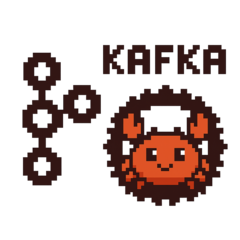

<div align="center">
  

# kacrab

**A Rust-native Apache Kafka client for producer, consumer, and admin use cases,
built from the Kafka protocol up. It is not a `librdkafka` wrapper.**

[![CI][ci-badge]][ci-url]
[![real-broker][real-broker-badge]][real-broker-url]
[![crates.io][crates-badge]][crates-url]
[![docs.rs][docs-badge]][docs-url]
[![MSRV][msrv-badge]][msrv-url]
[![MIT licensed][mit-badge]][mit-url]
[![Apache-2.0 licensed][apache-badge]][apache-url]

</div>

[ci-badge]: https://github.com/pirumu/kacrab/actions/workflows/ci.yml/badge.svg?branch=master
[ci-url]: https://github.com/pirumu/kacrab/actions/workflows/ci.yml
[real-broker-badge]: https://github.com/pirumu/kacrab/actions/workflows/real-broker.yml/badge.svg?branch=master
[real-broker-url]: https://github.com/pirumu/kacrab/actions/workflows/real-broker.yml
[real-broker-auth-url]: https://github.com/pirumu/kacrab/actions/workflows/real-broker-auth.yml
[fuzz-url]: https://github.com/pirumu/kacrab/actions/workflows/fuzz.yml
[rustsec-rsa]: https://rustsec.org/advisories/RUSTSEC-2023-0071
[book-url]: https://pirumu.github.io/kacrab/
[compat-url]: https://pirumu.github.io/kacrab/broker-compatibility.html
[cancel-url]: https://pirumu.github.io/kacrab/cancellation.html
[codegen-url]: https://pirumu.github.io/kacrab/codegen.html
[crypto-url]: https://pirumu.github.io/kacrab/security.html#choosing-a-crypto-provider
[coverage-url]: https://pirumu.github.io/kacrab/testing-and-ci.html
[fuzzing-url]: https://pirumu.github.io/kacrab/testing-and-ci.html#fuzzing
[share-url]: https://pirumu.github.io/kacrab/consumer.html#the-other-consuming-surface-share-groups
[crates-badge]: https://img.shields.io/crates/v/kacrab.svg
[crates-url]: https://crates.io/crates/kacrab
[docs-badge]: https://docs.rs/kacrab/badge.svg
[docs-url]: https://docs.rs/kacrab
[msrv-badge]: https://img.shields.io/crates/msrv/kacrab.svg
[msrv-url]: https://crates.io/crates/kacrab
[mit-badge]: https://img.shields.io/badge/license-MIT-blue.svg
[mit-url]: LICENSE-MIT
[apache-badge]: https://img.shields.io/badge/license-Apache--2.0-blue.svg
[apache-url]: LICENSE-APACHE

## Highlights

Every surface follows Kafka property names, defaults, and wire semantics, so the
config keys you know from the Java client work here.

| Surface | What you get |
| --- | --- |
| [**Producer**](#producer) | Batching, bounded memory, compression (`gzip`/`snappy`/`lz4`/`zstd`), murmur2 + sticky/adaptive partitioning, multi-broker dispatch with failover, transactions, a Kafka-faithful idempotent path, interceptors, Kafka-named metrics. |
| [**Consumer**](#consumer) | Feature parity with the Java client 4.3.0: manual assignment, topic and regex subscription, classic groups (eager + `cooperative-sticky`) and the KIP-848 server-side protocol, incremental fetch sessions, truncation detection, sync/async/auto commit, static membership, typed deserializers, interceptors, `metrics()`. |
| [**Share consumer**](#share-consumer) | KIP-932, the queue-shaped surface: per-record `Accept`/`Release`/`Reject`, delivery-count tracking for poison messages, more consumers than partitions. |
| [**Admin**](#admin) | The full `Admin` surface of the Java client 4.3.0 — 62 operations: topics, configs, ACLs, groups & offsets, transactions, delegation tokens, quotas, SCRAM, reassignments, KRaft quorum, the 4.x share/streams families. |
| [**Auth**](#auth) | `PLAINTEXT`/`SSL`/`SASL_PLAINTEXT`/`SASL_SSL`; SASL `PLAIN`, `SCRAM-SHA-256/512`, `OAUTHBEARER`, feature-gated `GSSAPI`; PEM/JKS/PKCS12 stores, mutual TLS, custom-authenticator hooks. Failures fail fast with the broker's reason, matching Java. |

- **[Fast and lean](#benchmarks)** — producer throughput **+35%** over Java on
  small records at ~4x less memory, consumer **1.9-4x** higher at ~16x less
  memory; at Java's own offered load, latency is lower or tied at every
  percentile.
- **Native Rust, generated protocol** — pure Rust with `unsafe_code` forbidden
  workspace-wide; the TLS provider and optional codecs are the only C in the tree
  (see `pure-rust-tls` under [Install](#install)). Request/response structs are
  generated from Apache Kafka schemas and checked byte-for-byte against the Java
  client oracle.
- **Verified against real brokers, in CI** — every surface (producer, consumer,
  admin, every SASL mechanism and TLS mode, every codec, 3-broker failover) runs
  end-to-end against real Kafka containers as a merge gate on
  [every PR and push][real-broker-url] across a
  [five-release broker matrix](#broker-compatibility); authenticated listeners
  (SASL, TLS, GSSAPI against a real KDC) run
  [weekly and on auth-stack PRs][real-broker-auth-url].

## Broker compatibility

| | |
| --- | --- |
| **Minimum accepted** | Apache Kafka **2.4**. An older broker cannot answer the `ApiVersions` v3 handshake and is rejected on connect with a typed error naming the requirement — not a reconnect loop ending in a timeout. |
| **Verified in CI** | **3.3.2 · 3.6.2 · 3.9.0 · 4.0.0 · 4.3.0** — real containers running the real suites ([`real-broker.yml`][real-broker-url]). 4.3.0 is the blocking leg and runs the full suite; the older legs run the core suite (producer, classic consumer, compression, admin smoke) and are non-blocking evidence-gathering for now. 3.3.2 — the first leg inside the 2.4–3.5 range — runs nightly and on push, not on PRs. |
| **2.4 – 3.5** | Accepted and negotiated, covered offline by golden `ApiVersions` fixtures and `MockBroker` tests — and CI-verified at **3.3.2** (core suite, nightly) since the KRaft-GA line fits the repo's single-broker fixture shape. Below 3.3 (including 2.8, which needs a ZooKeeper-shaped fixture): accepted, not yet CI-verified. |
| **Maximum** | Schemas are generated from Apache Kafka **4.3.0**; a newer broker negotiates down under Kafka's own bidirectional compatibility model. Tested up to 4.3.0. |

Feature floors are gated on what a broker *advertises*, never on a release number
— 3.9 ships KIP-848 at early-access v0, so a version rule would refuse a broker
that works:

| Feature | Needs the broker to advertise | Present in practice from |
| --- | --- | --- |
| Producer · classic consumer groups · core admin | APIs predating 2.4 | 2.4 |
| KIP-848 consumer group (`group.protocol=consumer`) | `ConsumerGroupHeartbeat` | 3.9 (early-access v0); v1 from 4.0 |
| Share consumer (KIP-932) | `ShareGroupHeartbeat` · `ShareFetch` · `ShareAcknowledge` | 4.3 |

No request version is hardcoded anywhere: every API is negotiated per connection
from that broker's own `ApiVersions` response, and an API that cannot be
negotiated raises a typed error naming the API and both version ranges rather
than downgrading silently. Feature gates fire right after the coordinator lookup
and name the mode that would have worked. Matrix legs, capability-aware admin
skips, and the fixture evidence behind every row:
[Which brokers kacrab speaks to][compat-url].

## How this compares to the other Rust Kafka clients

If you are already in Rust, the question is not "kacrab vs the Java client" — it
is "why not `rust-rdkafka`". Verified against each project's own documentation
and release history as of 2026-07-27:

| | kacrab 0.3 | rust-rdkafka 0.39 | rskafka 0.6 | kafka-rust 0.10 |
| --- | --- | --- | --- | --- |
| Implementation | Rust protocol stack | wraps librdkafka 2.12.1 (C) | Rust | Rust |
| Build needs | `cargo` alone | C toolchain, GNU make, pthreads (or the `cmake-build` feature); librdkafka sources vendored and statically linked by default | `cargo` alone | `cargo` alone |
| Async model | tokio-native | tokio via `StreamConsumer`/`FutureProducer` over librdkafka's own poll threads | tokio-native | blocking |
| Consumer groups | classic + KIP-848 | classic + KIP-848 (GA in librdkafka 2.12, opt in via `group.protocol`) | none — explicit non-goal | classic |
| Transactions | yes | yes | none — explicit non-goal | not documented |
| Admin API | 62 operations | yes | none | not documented |
| Broker versions | 2.4 floor, 4.3.0 schemas negotiated down per broker; [CI matrix on 3.6.2/3.9.0/4.0.0/4.3.0](#broker-compatibility) | broad | not stated | tested 0.8.2–3.1 |
| Untrusted-byte decode path | Rust, `forbid(unsafe_code)` workspace-wide, [11 fuzz targets nightly][fuzz-url] | C (librdkafka) | Rust | Rust |

rskafka states its own scope plainly (*"No support for offset tracking, consumer
groups, transactions, etc."*) and kafka-rust warns *"Use it in production at your
own risk"* and has not released since 2023, so the real comparison is
`rust-rdkafka` — narrower than the table looks, since both track the same
protocol. **Choose `rust-rdkafka` if** you need years of production mileage,
verified support for Kafka older than 3.6, or the ecosystem grown around
librdkafka; it is the safe default and this project does not pretend otherwise.
**Choose kacrab if** a C toolchain in your build is a real cost — cross
compilation, musl static builds, `cargo install` for downstream users, audit
surface — or you want Rust the whole way down: `forbid(unsafe_code)`,
tokio-native backpressure instead of a wrapped poll loop, Kafka errors as typed
Rust enums. The honest limits are in
[When not to use kacrab](#when-not-to-use-kacrab); kacrab also generates the
protocol rather than depending on
[`kafka-protocol`](https://crates.io/crates/kafka-protocol), for the reasons in
the [codegen chapter][codegen-url].

## Documentation

- **[Design & Internals book][book-url]** — idempotent producer state machine,
  consumer rebalancing and fetching, SASL/TLS handshakes, protocol codegen,
  [broker compatibility][compat-url], [cancellation semantics][cancel-url],
  benchmark methodology. Source in [`docs-book/`](docs-book/).
- **API reference** — [docs.rs/kacrab](https://docs.rs/kacrab).
- **Release notes** — [`CHANGELOG.md`](CHANGELOG.md); kacrab is pre-1.0, so minor
  versions can break API. **MSRV** 1.95, pinned in `rust-toolchain.toml` and
  checked in CI; a bump is a breaking change with its own changelog entry, never
  in a patch release.

## Status

Protocol, wire, auth, producer, consumer, and admin all have a verified usable
baseline. What remains before production-ready is **mostly measurement under
load** ([`ROADMAP.md`](ROADMAP.md)) plus the one known correctness gap, the
compound-failure path in [`SOAK-REPORT.md`](SOAK-REPORT.md); both are itemised
under [When not to use kacrab](#when-not-to-use-kacrab). **Kafka Streams is out
of scope**, permanently: kacrab is a Kafka *client* library and deliberately
stops at the primitives a streams runtime would build on (transactions, consumer
groups, offsets). Test coverage (`cargo llvm-cov`) is **~87% maintained-source**
line coverage (generated protocol excluded), producer module ~92%; the raw
whole-workspace number is lower because codegen covers all 93 Kafka API keys to
keep the Java oracle exhaustive while the client wires the 70 a client actually
issues — arithmetic in the [coverage section][coverage-url].

## Install

Nothing is enabled by default (`default = []`) — turn on the surfaces you use:

```toml
[dependencies]
kacrab = { version = "0.4", features = ["producer", "consumer", "admin", "aws-lc-rs-tls"] }
tokio = { version = "1", features = ["macros", "rt"] }
```

Features: `producer`, `consumer`, `admin`, `share-consumer` (each example below
names the one it needs); compression codecs `gzip`, `lz4`, `snappy`, `zstd` (or
`compression` for all four); Kerberos via `gssapi`; config macro helpers via
`macros`. **TLS needs a crypto provider named explicitly** — `aws-lc-rs-tls` (the
default, what CI exercises) or `pure-rust-tls` (`ring`-backed, no `aws-lc-sys`);
a `PLAINTEXT`-only build names neither and compiles no crypto backend at all,
and configuring TLS with neither fails at config validation. One capability
differs: locally signing an `OAUTHBEARER` JWT assertion needs `aws-lc-rs-tls`,
because `pure-rust-tls` drops `jsonwebtoken` rather than pull in `rsa` and
[RUSTSEC-2023-0071][rustsec-rsa]. Full rationale and the
`make check-pure-rust-tls` guard: [Choosing a crypto provider][crypto-url].

## Producer

Requires the `producer` feature. `send` is synchronous like Kafka's
`Producer.send`: it returns a `SendFuture` immediately and you await that for the
broker acknowledgement. Batching happens through `batch.size`, `linger.ms`,
buffer memory, and flush/close boundaries — the background sender drains on
`linger.ms`, so `flush()` is only an "every prior send completed" barrier and
`close()` already flushes.

```rust,ignore
use kacrab::producer::{Producer, ProducerRecord};

let producer = Producer::builder()
    .set("bootstrap.servers", "127.0.0.1:9092")
    .set("acks", "all")
    .set("enable.idempotence", "true")
    .set("linger.ms", "5")
    .build()
    .await?;

// `unassigned` lets the key pick the partition via murmur2 + the sticky
// partitioner, like Java; `ProducerRecord::new(topic, partition)` pins one.
let delivery = producer.send(
    ProducerRecord::unassigned("orders").key("order-42").value("created"),
)?;
let receipt = delivery.await?;
println!("{}-{}@{}", receipt.topic, receipt.partition, receipt.offset);
producer.close().await?;
```

`Producer` is `Send + Sync` and not `Clone`, so Java's one-producer-per-app model
maps to `Arc<Producer>`: the hot path and the whole transaction lifecycle take
`&self`, and only configuration hooks (`set_partitioner`, `add_interceptor`,
metric setup) take `&mut self` — call those before wrapping. The `close` family
takes `self`: `Arc::try_unwrap` the last handle, or just drop the `Arc`, which
resolves every incomplete delivery as `Err(ProducerError::DeliveryDropped)`
rather than losing it silently. One caveat: a **custom partitioner takes every
record off the inline fast path** (it may block or re-enter user code), so the
[Benchmarks](#benchmarks) numbers — measured on the built-in partitioner — do not
carry over. Transactions use the same producer (`transactional.id` +
`init_transactions`/`begin_transaction`/`commit_transaction`); interceptors and
Kafka-named metrics (`kafka_metrics()`) mirror the Java surface; serializers are
a compile-time trait (`ProducerSerializer<T>` via `build_with_serializers`)
rather than `key.serializer` class names
([`examples/typed_serializer.rs`](examples/typed_serializer.rs)).

## Consumer

Requires the `consumer` feature. Manual `assign` + `seek`/`position`/`pause`,
topic subscription, regex `subscribe_pattern`, and both group protocols:

```rust,ignore
use kacrab::consumer::{Consumer, StringDeserializer};

let mut consumer = Consumer::from_map([
    ("bootstrap.servers", "localhost:9092"),
    ("group.id", "orders-workers"),
    ("auto.offset.reset", "earliest"),
    // Incremental rebalancing; use ("group.protocol", "consumer") for KIP-848.
    ("partition.assignment.strategy", "cooperative-sticky"),
]).await?;
consumer.subscribe(["orders"])?;

let (keys, values) = (StringDeserializer, StringDeserializer);
loop {
    let records = consumer.poll(Duration::from_secs(1)).await?;
    for record in &records {
        let (key, value) = record.deserialized(&keys, &values)?;
        println!("{}-{}@{}: {key:?} = {value:?}", record.topic, record.partition, record.offset);
    }
    consumer.commit_sync().await?;
}
```

Records are bytes-first (`ConsumerRecord.key/value: Option<Bytes>`) with a typed
`ConsumerDeserializer` layer on top; offsets commit sync, async, or
automatically, with leader-epoch awareness. `ConsumerInterceptor`s and
`metrics()` round out the surface, and the Java lookup calls are all here —
`committed()`, `beginning_offsets()`, `end_offsets()`, `offsets_for_times()`,
`enforce_rebalance()` — plus rack-aware fetch-from-follower via `client.rack`
(KIP-392). `wakeup()` takes `&self`, so another task can interrupt a blocking
`poll`: the in-flight or next `poll` returns `ConsumerError::Wakeup`, matching
Java's `KafkaConsumer.wakeup()` (versus cancelling the future:
[Cancellation & drop semantics][cancel-url]). Rebalancing and fetching deep
dives: the book's [consumer chapter](docs-book/src/consumer.md).

## Share consumer

Requires the `share-consumer` feature and a broker advertising the KIP-932 APIs
([Broker compatibility](#broker-compatibility)). A share group turns a topic into
a work queue: records are *acquired* under a broker-held lock rather than read at
a position, so more consumers than partitions can share a topic and each record
is disposed of on its own instead of by committing an offset. `ShareConsumer` is
a separate type because `assign`, `seek`, `position`, and `commit_sync` mean
nothing in that model.

```rust,ignore
use kacrab::consumer::{AcknowledgeType, ShareConsumer};

let mut consumer = ShareConsumer::from_map([
    ("bootstrap.servers", "127.0.0.1:9092"),
    ("group.id", "work-queue"),
    ("share.acknowledgement.mode", "explicit"),
]).await?;
consumer.subscribe(["jobs"])?;

loop {
    for record in consumer.poll(Duration::from_millis(500)).await?.iter() {
        let outcome = if record.delivery_count > 5 {
            AcknowledgeType::Reject           // poison message: archive it
        } else if handle(record).is_ok() {
            AcknowledgeType::Accept
        } else {
            AcknowledgeType::Release          // hand it back for redelivery
        };
        consumer.acknowledge(record, outcome)?;
    }
    consumer.commit().await?;
}
```

`share.acknowledgement.mode=implicit` (the Kafka default) acknowledges the whole
batch with `Accept` on the next `poll`/`commit` and makes `acknowledge` an error;
`explicit` requires every delivered record to be acknowledged first.
`share.acquire.mode` controls whether a poll may exceed `max.poll.records` to
land on batch boundaries. Acknowledgements are batched and piggy-backed onto the
next `ShareFetch`, costing no extra round trip. The surface maps one-to-one onto
Java's `ShareConsumer` — full mapping, and why `commit_async` deliberately sends
nothing by itself, in the [share-group section][share-url]. The admin-side view
of the same groups (`describe_share_groups`, `list_share_group_offsets`, ...)
lives on `AdminClient` and needs only the `admin` feature.

## Admin

Requires the `admin` feature. Admin mirrors Java's `Admin` with `snake_case`
methods and per-call options structs, using the same Kafka config keys including
`security.protocol`/TLS/SASL:

```rust,ignore
use kacrab::admin::{AdminClient, CreateTopicsOptions, NewTopic};

let admin = AdminClient::from_map([("bootstrap.servers", "localhost:9092")]).await?;
let topics = vec![NewTopic::new("orders", 6, 3)];
admin.create_topics(topics, CreateTopicsOptions::default()).await?;
for topic in admin.list_topics(Default::default()).await? {
    println!("{}", topic.name);
}
```

All 62 operations are verified against a real broker across every routing path
(controller, coordinator with transient-error retry, per-leader, broadcast). On
older brokers the smoke suite is capability-aware: an operation a broker cannot
express is a named skip, not a failure
([Broker compatibility](#broker-compatibility)). Shared `org.apache.kafka.common`
domain types (`TopicPartition`, `Node`, ...) live in `kacrab::common`. Runnable
tour: [`examples/admin.rs`](examples/admin.rs).

## Auth

Kafka-compatible property names throughout. JAAS strings are accepted for
migration, but kacrab only parses the credential options and never loads Java
login modules. Anything touching TLS needs a crypto provider feature
([Install](#install)):

```rust,ignore
let producer = Producer::builder()
    .set("bootstrap.servers", "broker-1:9093")
    .set("security.protocol", "SASL_SSL")
    .set("ssl.truststore.location", "/etc/kafka/client.truststore.p12")
    .set("ssl.truststore.password", "secret")
    .set("sasl.mechanism", "SCRAM-SHA-512")
    .set("sasl.jaas.config", r#"username="user" password="pass";"#)
    .build()
    .await?;
```

OAuth bearer tokens come from JAAS options, files, HTTP(S) token endpoints, or
locally signed JWT assertions (that last needs `aws-lc-rs-tls`); custom SASL
flows plug in through `sasl_client_authenticator(...)`.

## Benchmarks

kacrab vs the Java client on the same native single-node Apache Kafka 4.3.0
broker, topic, and defaults (`acks=all` + idempotence; consumer at
`max.poll.records=500`); host MacBook Pro M3 Pro (11-core, 18 GB), broker
co-located. Methodology, reproduction commands, and full caveats:
[`benches/README.md`](benches/README.md) and the
[benchmarks chapter](docs-book/src/benchmarks.md).

**Producer** (2026-07-27; medians of 5 interleaved kacrab/Java pairs). Rows one
and two are the default parity scenarios; the third drives the
`MESSAGE_TOO_LARGE` batch-split path, which kacrab clears in one broker round
trip per batch fewer than Java:

| Scenario | kacrab | Java `kafka-producer-perf-test` |
| --- | ---: | ---: |
| 5M x 10 B, 16 partitions | **5.00M rec/s (47.6 MB/s)** | 3.70M rec/s (35.3 MB/s) |
| 100K x 10 KiB, 3 partitions | **49.5K rec/s (483 MB/s)** | 43.0K rec/s (420 MB/s) |
| 20K x 4 KiB, `max.message.bytes` below `batch.size` (batch-split path) | **59.3K rec/s (232 MB/s)** | 26.9K rec/s (105 MB/s) |
| Latency at Java's own rate (10 B) | **0.11 ms avg / 2 ms p99 / 4 ms max** | 0.32 ms / 2 ms / 131-140 ms |
| Peak RSS / CPU (10 B run, 2026-06-28) | **~68 MiB / ~2.7 s** | ~268 MiB / ~4.1 s |

**Consumer** (2026-07-02):

| Scenario | kacrab | Java `kafka-consumer-perf-test` |
| --- | ---: | ---: |
| 5M x 10 B, 16 partitions | **~17.6M rec/s** | ~9.3M rec/s |
| 100K x 10 KiB, 3 partitions | **~5.3 GB/s** | ~1.3 GB/s |
| Peak RSS / poll() max (10 B run) | **~18 MiB / ~8 ms** | ~286 MiB / ~111 ms |

Re-verified at 0.4.0 against master (2026-07-27): producer a wash within ±1.5%
over four interleaved real-broker pairs, consumer throughput inside a measured
±1.7% A/A noise floor, accumulator microbenchmark back at baseline. The
[A/B discipline](benches/README.md#ab-discipline) that makes those statements
meaningful — and that caught a fabricated −11% consumer "regression" this cycle —
is documented with them.

Caveats: single-node, RF=1, broker co-located, so this is a client-efficiency
signal, not a production throughput claim; 10-byte rows inflate records/sec, so
the byte-rate columns compare better (both `MB/sec` columns computed identically
to Java's own perf tool). **Latency is closed-loop saturation latency** — each
client measures at its own saturation point while kacrab pushes ~35% more
throughput; pinned to Java's rate kacrab wins or ties every percentile, and
Java's ~130 ms maxima are JVM pauses
([matched-load detail](benches/README.md#matched-load-latency)). Every kacrab run
had zero retries/errors with fully correct idempotence; the
[complete caveat list](benches/README.md#limits-of-this-pass) is longer.

## Cancellation & drop semantics

Async Kafka clients get raced in `tokio::select!` and dropped on shutdown paths,
so kacrab publishes a per-future contract: `Producer::send`'s `SendFuture` and
`Consumer::poll` are cancel-safe for records; `flush`/`close` and both commit
paths are not; the transactional operations (`init_transactions`,
`commit`/`abort_transaction`, `send_offsets_to_transaction`) are not cancel-safe
but are **not abandoned** — the round trip finishes on its own task and re-calling
the same operation picks the result back up. Dropping a client without `close()`
never loses data silently either. Every future, what a mid-await drop costs, the
two `poll` caveats, and drop-without-close for all three clients:
[Cancellation & drop semantics][cancel-url].

## When not to use kacrab

- **You need a broker older than 3.6 and cannot test it yourself.** The 2.4 floor
  is enforced and the negotiation is real, but CI containers only cover 3.6.2
  upward, so 2.4–3.5 is *accepted, not yet CI-verified*
  ([Broker compatibility](#broker-compatibility)) — reach for `rust-rdkafka`.
- **You need Kafka Streams.** Out of scope, permanently — this is a client
  library ([Status](#status)).
- **You need years of production mileage.** kacrab is pre-1.0 and first published
  in July 2026; the API can change between minor versions, and `rust-rdkafka`
  wraps a library with over a decade in production that no benchmark closes.
- **Your workload is cross-DC or high-RTT.** Every number here comes from a
  co-located broker at sub-millisecond RTT; timeout, backoff, and in-flight
  interactions that only appear at 50–200 ms RTT are untested (item B2 in
  [`ROADMAP.md`](ROADMAP.md), not done), as is sustained multi-broker stress.
- **You need a long-soak guarantee.** The one published multi-hour run
  ([`SOAK-REPORT.md`](SOAK-REPORT.md)) went 4 h 17 m healthy across ~25
  broker-kill cycles, then wedged during a compound infra failure; the defects
  are fixed in code but the confirming re-run has not happened, so treat that
  branch as open. Memory soak (B3) and latency-percentile gates are outstanding.
- **You need bindings for another language.** There are none, and none planned.

## Testing

```bash
make fmt-check clippy test    # workspace suite, all features
make check-features           # every feature selection a user can actually make
make deny                     # dependency & license checks
```

`check-features` exists because every other gate runs `--all-features`, the one
configuration nobody ships: an internal gated on the wrong surface compiles there
and breaks for whoever enables a single feature — exactly how `--features
consumer` alone stayed broken. CI runs it as its own job. Real-broker suites are
`#[ignore]`d and run against the local compose files
(`docker-compose.{kafka,kafka-bitnami,kafka-admin,auth,gssapi,tls,cluster}.yml`),
with `KAFKA_IMAGE` selecting the broker release:

```bash
docker compose -f docker-compose.kafka.yml up -d
cargo test -p kacrab --test real_kafka_producer --all-features -- --ignored --nocapture
```

Protocol compatibility is also gated by a byte-for-byte Java oracle matrix (`make
test-protocol-java-matrix`; needs Java + Maven), and version negotiation by
golden `ApiVersions` fixtures captured from real brokers, which run in the
default suite with no container ([Broker compatibility](#broker-compatibility)).
Line coverage runs via `cargo llvm-cov` with generated artifacts excluded — see
[`Makefile`](Makefile). The oracle proves the decoders correct on *well-formed*
input; the other half — garbage, truncation, hostile length prefixes — is covered
by eleven [`cargo-fuzz`](https://github.com/rust-fuzz/cargo-fuzz) targets over
every parser reading untrusted bytes, because `forbid(unsafe_code)` rules out
memory corruption but not a panic or an unbounded allocation, and a panic on a
decode path is a denial of service. They run [nightly][fuzz-url] and as a
60-second smoke on any PR touching `kacrab-protocol/` — what each one guards is
in the [fuzzing section][fuzzing-url].

## Workspace

Published on crates.io: [`kacrab/`](kacrab/) — runtime crate: config, wire,
common, producer, consumer, admin ([crates.io](https://crates.io/crates/kacrab) ·
[docs.rs](https://docs.rs/kacrab)); [`kacrab-protocol/`](kacrab-protocol/) —
protocol primitives, generated Kafka schemas, record batch codecs, compression,
Java interop tests ([crates.io](https://crates.io/crates/kacrab-protocol) ·
[docs.rs](https://docs.rs/kacrab-protocol)); [`kacrab-macros/`](kacrab-macros/) —
helper macros for typed config surfaces, used through the `kacrab` re-export
rather than depended on directly
([crates.io](https://crates.io/crates/kacrab-macros) ·
[docs.rs](https://docs.rs/kacrab-macros)). Internal, not published:
[`kacrab-codegen/`](kacrab-codegen/) — protocol and config code generation from
upstream Kafka; [`examples/`](examples/) — runnable producer/consumer/admin
examples; [`benches/`](benches/) — real-Kafka harnesses and microbenchmarks;
[`fuzz/`](fuzz/) — `cargo-fuzz` targets for the untrusted-byte decoders (outside
the workspace: needs nightly plus a sanitizer).

## License

Authored and maintained by `pirumu`. Licensed under either of:

- [MIT license](LICENSE-MIT)
- [Apache License, Version 2.0](LICENSE-APACHE)
