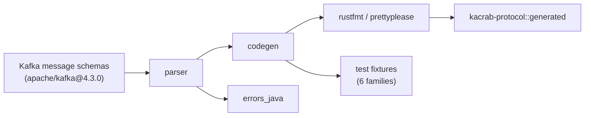

# Protocol code generation

The Kafka wire protocol is hundreds of request/response types across dozens of
versions, with flexible/compact encodings, nullable fields, tagged fields, and
nested schemas. Hand-writing and hand-maintaining that is how subtle wire bugs
are born. kacrab **generates** it from the upstream schemas and checks the result
against the Java client as an external oracle.

## `kacrab-codegen`

A maintainer-only tool (not published to crates.io — no runtime crate depends on
it) with two subcommands:

- **`protocol`** — parse the Apache Kafka 4.3.0 message schemas and emit the Rust
  request/response structs (and their encode/decode) into `kacrab-protocol`,
  plus the generated test fixtures.
- **`config`** — extract upstream `ConfigDef` declarations into the typed config
  metadata that backs `ClientConfig` and the producer/consumer/admin configs.

The pipeline handles the things that make Kafka's protocol fiddly: per-version
field presence, compact vs non-compact (flexible) versions, tagged fields, and
nested schema traversal.

## The Java oracle matrix

This is the part that makes the generated code trustworthy. Generated fixtures
are **encoded by Rust and decoded by the real Kafka Java client, and vice-versa**,
across six fixture families — 625 cases each:

| Family | What it stresses |
|---|---|
| `null_optionals` | nullable fields set to null per version |
| `populated` | deterministic non-default values + tagged fields |
| `empty_collections` | arrays/maps present but empty |
| `multi_element_collections` | arrays/maps with several elements |
| `numeric_boundaries` | integer/float min/max edges |
| `tagged_fields` | flexible-version tagged-field encoding |

Passing the matrix means: Rust encoders produce bytes Kafka Java can decode for
every represented schema version, Rust decoders consume Java-produced bytes, and
a decode/re-encode preserves the exact byte sequence.

> **Why an oracle, not just round trips**
>
> A Rust-only round trip (encode then decode in Rust) passes even if Rust
> *consistently* writes the wrong wire shape and then reads its own wrong shape
> back. The Java client is treated as the external source of truth for Kafka's
> wire contract — the same philosophy as the real-broker
> [verification](./verification.md), one layer down.

## What it does not prove

The matrix is not exhaustive over every value combination, and it does not cover
broker/client *behavior* outside message serialization (that is what the unit
tests, the idempotent fixtures, and the real-broker integration tests are for).
It proves cross-language *wire compatibility* for the generated schema surface.
