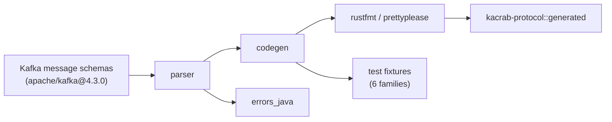

# Learning the language: protocol codegen

You cannot explore a territory whose language you don't speak — and Kafka's
language is hundreds of request/response types across dozens of versions, with
flexible/compact encodings, nullable fields, tagged fields, and nested
schemas. Hand-writing and hand-maintaining that is how subtle wire bugs are
born. So before setting out, kacrab **generates** the entire protocol from the
upstream schemas — and, not trusting its own pronunciation, checks the result
against the Java client as an external oracle.

## `kacrab-codegen`

A maintainer-only tool (not published to crates.io — no runtime crate depends on
it) with two subcommands:

- **`protocol`** — parse the Apache Kafka 4.3.0 message schemas and emit the Rust
  request/response structs (and their encode/decode) into `kacrab-protocol`,
  plus the generated test fixtures.
- **`config`** — extract upstream `ConfigDef` declarations into the typed config
  metadata that backs `ClientConfig` and the producer/consumer/admin configs.

```mermaid
flowchart LR
  S["Kafka message schemas<br/>(apache/kafka@4.3.0)"] --> P["parser"]
  P --> C["codegen"]
  C --> F["rustfmt / prettyplease"]
  F --> O["kacrab-protocol::generated"]
  P --> EJ["errors_java"]
  C --> TU["test fixtures<br/>(6 families)"]
```

The pipeline handles the things that make Kafka's protocol fiddly: per-version
field presence, compact vs non-compact (flexible) versions, tagged fields, and
nested schema traversal.

## The Java oracle matrix

This is the part that makes the generated code trustworthy. Generated fixtures
are **encoded by Rust and decoded by the real Kafka Java client, and vice-versa**,
across six fixture families — 625 cases each:

| Family | What it stresses |
|---|---|
| `null_optionals` | nullable fields set to null per version |
| `populated` | deterministic non-default values + tagged fields |
| `empty_collections` | arrays/maps present but empty |
| `multi_element_collections` | arrays/maps with several elements |
| `numeric_boundaries` | integer/float min/max edges |
| `tagged_fields` | flexible-version tagged-field encoding |

Passing the matrix means: Rust encoders produce bytes Kafka Java can decode for
every represented schema version, Rust decoders consume Java-produced bytes, and
a decode/re-encode preserves the exact byte sequence.

> **Why an oracle, not just round trips**
>
> A Rust-only round trip (encode then decode in Rust) passes even if Rust
> *consistently* writes the wrong wire shape and then reads its own wrong shape
> back. The Java client is treated as the external source of truth for Kafka's
> wire contract — the same philosophy as the real-broker
> [verification](./verification.md), one layer down.

## What it does not prove

The matrix is not exhaustive over every value combination, and it does not cover
broker/client *behavior* outside message serialization (that is what the unit
tests, the idempotent fixtures, and the real-broker integration tests are for).
It proves cross-language *wire compatibility* for the generated schema surface.

## The config surface is generated too

The `config` subcommand extracts upstream `ConfigDef` declarations into the
catalog behind `ClientConfig` — which is why every key in the
[field guide](./field-guide/foundations.md) carries Kafka's own name, type,
default, and validation. The hand-curated typed API is cross-checked against
that catalog by a drift test, so a config documented in this book is a config
that exists, with the semantics upstream gave it.

## Why generate, instead of depending on `kafka-protocol`

[`kafka-protocol`](https://crates.io/crates/kafka-protocol) is the established
Rust implementation of the Kafka wire format — well over 7M downloads, generated
from the same upstream JSON schemas kacrab reads. Reaching for it would have
been the default choice, so the reason not to should be stated rather than
assumed. It is a *types and codecs* crate by design, and kacrab needs the
generator itself, not only its output:

- **The generated code is the oracle harness.** `kacrab-protocol` emits, for
  every message at every schema version, a fixture plus the Java class name that
  decodes it. `java_client_preserves_all_rust_generated_protocol_fixtures`
  (`kacrab-protocol/tests/java_interop.rs`) compiles against
  `org.apache.kafka:kafka-clients:4.3.0` and asserts every fixture round-trips
  **byte-for-byte** through the real Java client, in both directions. That check
  is only exhaustive because the generator produces the cases along with the
  structs — bolting it onto a dependency's output means hand-maintaining the
  matrix, and a hand-maintained matrix stops being exhaustive the first time a
  schema version is added.
- **The fuzz seeds come from the same fixtures.** `generate_fuzz_corpus` in that
  same harness emits `fuzz/seeds/` from the exact bytes the oracle validated.
  The seeded-versus-unseeded edge counts in
  [Testing, coverage & CI](./testing-and-ci.md#fuzzing) are the measure of what
  that buys; the corpus exists because the fixtures already did.
- **The client needs metadata the wire types do not carry.** Version negotiation
  resolves through generated `client_api_info`
  (`kacrab-protocol/src/version.rs`), and the producer hot path preallocates
  from generated `encoded_len` rather than encoding into a growing buffer
  (`kacrab/src/producer/batch.rs`). Both are generator outputs shaped by how the
  client uses them.
- **The Kafka version is a pinned input, not a dependency's release cadence.**
  kacrab pins the schema source at `apache/kafka@4.3.0` and regenerates on
  demand (request versions themselves are still negotiated per broker); the
  same resolver also generates the config catalog, so protocol and config never
  drift to different upstream revisions.

None of this is a defect in `kafka-protocol` — it is a different job. If you
want Kafka wire types in your own project and not a client, use it.
