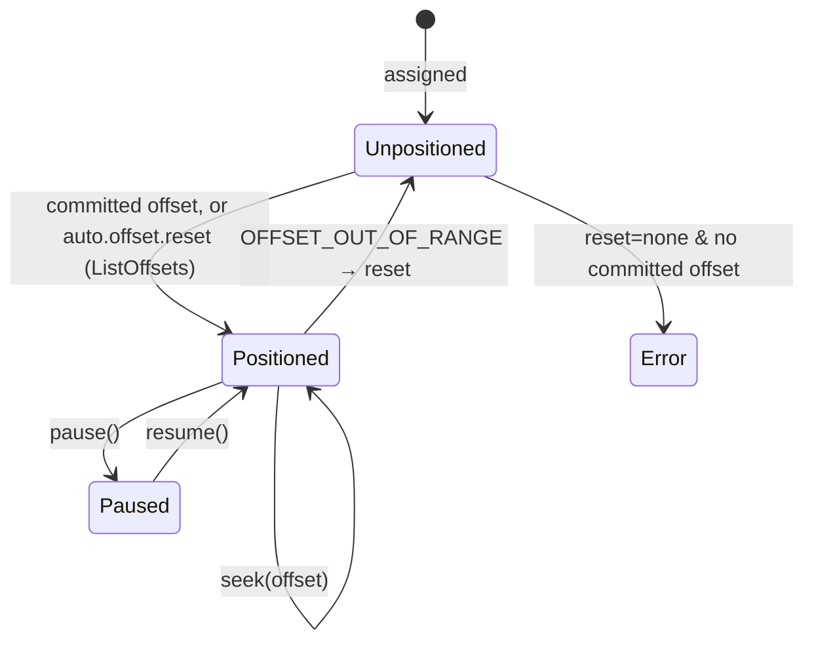
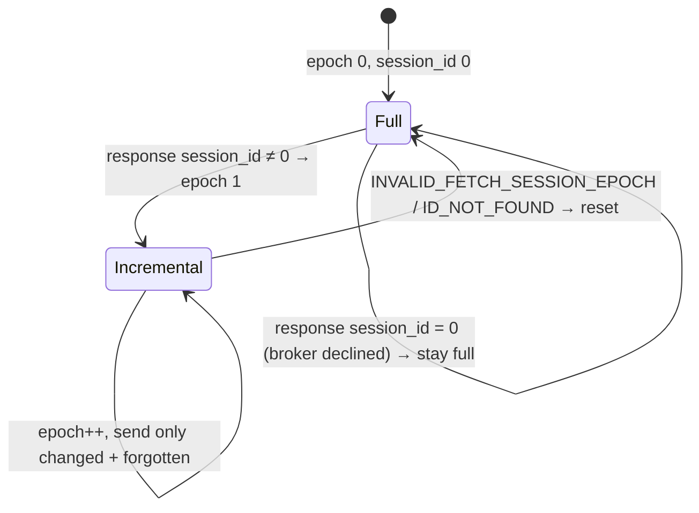
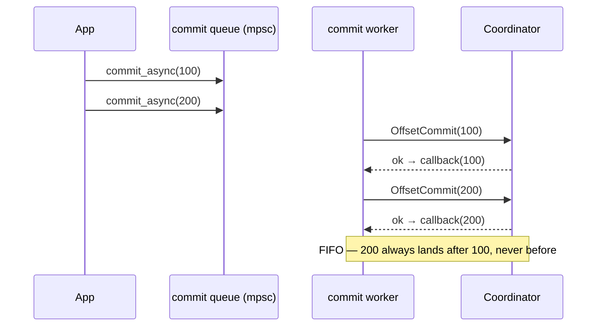

# Reading in order: fetching, positions & offsets

Once a consumer owns partitions, the rest of the road is reading: in order,
from the right place, surviving the log moving underneath, remembering how far
it got. Three state machines cooperate — the **position** of each partition,
the per-broker **fetch session**, and the **committed offset** at the
coordinator — and this leg is also where the consumer's *performance* was won:
the three mechanisms that carry the [benchmark numbers](../benchmarks.md) all
live in the fetch loop below, each added after a measurement exposed its
absence.

> **The invariant we defend**
>
> Each assigned partition has a single monotonic *fetch position*. Records are
> delivered in offset order starting at that position; the position only ever
> advances **past records actually handed to the caller**. A partition whose
> position becomes invalid (aged out, truncated) is *re-resolved*, never skipped
> and never stuck — and one bad partition never stalls the others.

## The position state machine

A newly assigned partition has no position. Before it can be fetched, one is
resolved — from the committed offset if there is one, otherwise from
`auto.offset.reset` (`earliest`/`latest` via `ListOffsets`, or a
`NoOffsetForPartition` error under `none`).

`seek`/`seek_to_beginning`/`seek_to_end` overwrite the position; `pause`/`resume`
toggle whether a positioned partition is fetchable. Only assigned, unpaused,
positioned partitions are eligible for a fetch.

## The fetch loop

One fetch typically returns far more than one poll may yield (up to
`max.partition.fetch.bytes` per partition against a `max.poll.records` cap of
500), so responses are **buffered across polls** — Java's `completedFetches` +
`nextInLineFetch`, kacrab's `FetchBuffer`. Each `poll` first drains the buffer:
up to `max.poll.records` records are returned straight from memory, advancing
each partition's position past what was yielded. Buffered blobs decode
**lazily, one record batch at a time** (Java's `CompletedFetch` iterator), so
memory holds the raw blobs plus roughly one batch of decoded records. A
partition is only re-fetched once its buffered data runs dry — for a 5M-record
scenario that is ~13 Fetch RPCs instead of 10,000. Buffered data is invalidated
lazily at drain time (a seek/reset moved the position, or a rebalance revoked
the partition) and retained across `pause`/`resume`.

The next fetch is **pipelined** (Java's network thread): as soon as fetchable
partitions run dry, their `Fetch` is spawned as a background task — grouped
**by leader**, one in flight — while the caller keeps draining buffered
records; a poll that finds the buffer empty awaits the in-flight fetch only up
to its own timeout. One guard matters (Java's buffered-node gate): a node that
still hosts buffered partitions is not fetched from at all. Omitting its
buffered partitions would drop them from the broker's fetch-session cache, and
a request listing only caught-up partitions would long-poll
`fetch.max.wait.ms` while the buffer drains dry behind it. Fetches negotiate up
to the broker's version: v13+ keys partitions by **topic id** (KIP-516), with
ids resolved from the routing metadata and mapped back to names on the response
(Java's `sessionTopicNames`); a topic with no id — or a pre-v13 broker —
downgrades that fetch to v12, the last name-keyed version, exactly like Java's
`AbstractFetch`.

Because the broker holds a fetch for up to `fetch.max.wait.ms` waiting for
`fetch.min.bytes`, kacrab **clamps that wait to the caller's remaining poll
budget** — a `poll(200ms)` is not blocked for a 500 ms (or 2 s) broker wait. The
long-poll means an idle `poll` doesn't busy-spin, while the clamp keeps short
polls responsive.

## Incremental fetch sessions (KIP-227)

Re-sending every partition's offset on every fetch is wasteful when the
assignment is stable. A fetch **session** lets the broker remember the set: the
first fetch to a leader is *full* and opens a session; later fetches send only
the partitions whose position **changed**, plus a *forgotten* list for ones no
longer fetchable. The broker replies with only the partitions that have new
data. (The buffered-node gate above keeps buffered partitions from churning
through the forgotten list: a node is simply not fetched from until its
buffered data drains.)

The behaviour is identical to full fetches — it is purely a smaller request. A
stale-session error drops the session and re-establishes it with a full fetch on
the next poll. kacrab keeps this state per broker, across polls.

## One bad partition doesn't sink the poll

A `Fetch` response carries a status **per partition**. Treating any of them as
fatal is wrong — most are routine and partition-local. In particular
`OFFSET_OUT_OF_RANGE` (retention aged the committed offset out, or a seek landed
past the log end) is a *normal* condition that must reset the position; failing
the whole poll would loop forever, because the out-of-range partition keeps its
stale position and so is never re-resolved.

kacrab classifies each partition's error, mirroring Java's `AbstractFetch`, and
keeps the records decoded from the healthy partitions in the same response:

| Partition error | Action |
|---|---|
| `OFFSET_OUT_OF_RANGE` | clear the position → `auto.offset.reset` re-resolves next poll |
| `NOT_LEADER_OR_FOLLOWER`, `FENCED`/`UNKNOWN_LEADER_EPOCH`, `UNKNOWN_TOPIC_OR_PARTITION`, `REPLICA_NOT_AVAILABLE`, `LEADER_NOT_AVAILABLE`, `KAFKA_STORAGE_ERROR`, `OFFSET_NOT_AVAILABLE` | flag stale → invalidate cached metadata, retry next poll |
| anything else | fatal — surface to the caller |

The response handling is a pure function returning
`FetchProgress { partitions, resets, stale }`, unit-tested with synthesized
responses and verified end to end: a fetch positioned past the log end resets to
`earliest` and consumes every record instead of erroring.

## Truncation detection (KIP-320)

A leader change can expose that the log was **truncated** below the consumer's
position — the offsets it was about to read no longer exist. After a leader
epoch bump is visible in metadata, kacrab validates the position with
`OffsetForLeaderEpoch`: the leader reports the end offset of the largest epoch at
or below the position's epoch. If that end offset is **below** the position, the
log diverged and the position resets down to it; otherwise the position is
confirmed and its recorded epoch advances so it isn't re-validated. (The decision
and request encoding are unit-tested; a real truncation cannot be staged on the
single-broker rig.)

## Committing offsets

Committed offsets live at the coordinator (`OffsetCommit`/`OffsetFetch`, capped
at name-keyed versions). A commit carries the member identity —
generation/epoch + member id — which the coordinator requires from a group member
under either protocol. `commit_sync` blocks; `committed` reads back; both retry
once after re-finding a moved coordinator.

### Asynchronous commits stay in order

`commit_async` must not let a *later* commit lose to an *earlier, slower* one — a
stale commit landing last would move the committed offset **backwards** and cause
reprocessing after the next rebalance.

> **The concurrent-task adaptation**
>
> A naïve `commit_async` spawns a task per call, and two tasks race to the
> coordinator with no ordering guarantee. kacrab instead routes async commits
> through a **single unbounded queue drained by one worker** that applies each
> commit to completion before the next — the same guarantee Java gets from its
> single network thread. Because `commit_async` takes `&mut self`, calls are
> serialized at the source, so queue order is call order, and the worker preserves
> it. Verified: ten back-to-back commits with increasing offsets fire their
> callbacks in call order and leave the last offset committed.

### Auto-commit

With `enable.auto.commit`, the current positions are committed on a background
interval and once more before each rebalance (so a partition about to be revoked
commits its progress). Auto-commit failures are swallowed and retried on the next
interval, matching Java's best-effort async auto-commit.

## What's verified

Against a real Apache Kafka 4.3.0 broker
([Verification](../verification.md)): manual assign → consume → `commit_sync` →
read committed; the offset-query APIs and lag; auto and async commit; async
commits applying in call order with no regression; a fetch past the log end
resetting and recovering; and a short `poll` returning without waiting out a long
`fetch.max.wait.ms`. The fetch-session state machine and truncation classifier are
unit-tested (a real leader change / truncation can't be staged on one broker).

## Field notes

- `max.poll.records` shapes your poll-loop cadence, **not** network traffic —
  the buffer and prefetch above mean small values don't add RPCs. Size it to
  fit `max.poll.interval.ms`.
- Raise `fetch.min.bytes` to make the broker batch for you on
  high-throughput topics; kacrab's poll-budget clamp keeps short polls
  responsive anyway.
- `OFFSET_OUT_OF_RANGE` is weather, not an outage — but what it *resets to*
  is your `auto.offset.reset` choice. Under `latest`, an aged-out offset is
  a silent skip; choose deliberately.
- Prefer `commit_async` on the hot path (kacrab guarantees FIFO application)
  with one `commit_sync` at shutdown.

The [consumer field guide](../field-guide/consumer.md) develops all four.
