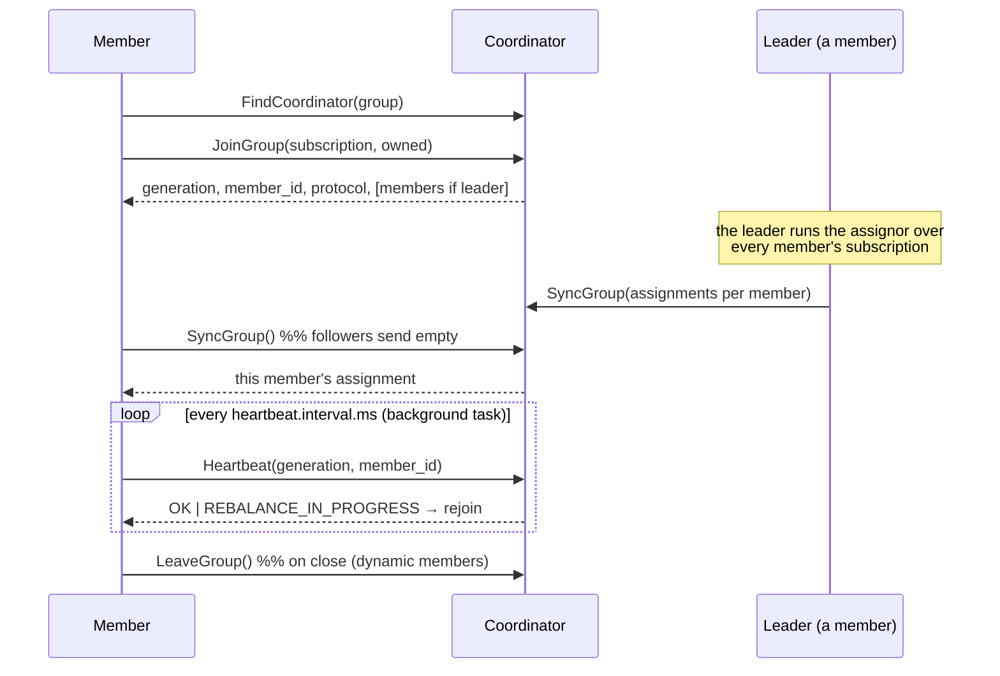
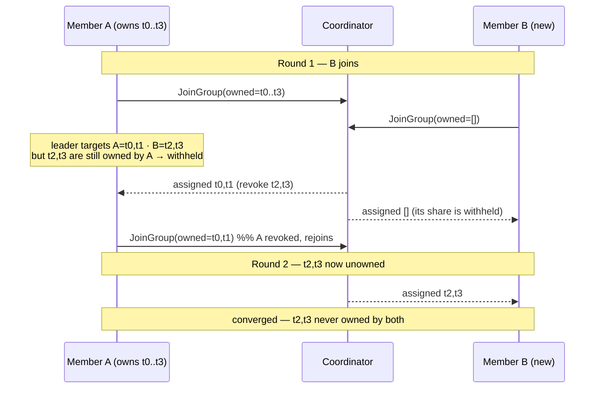
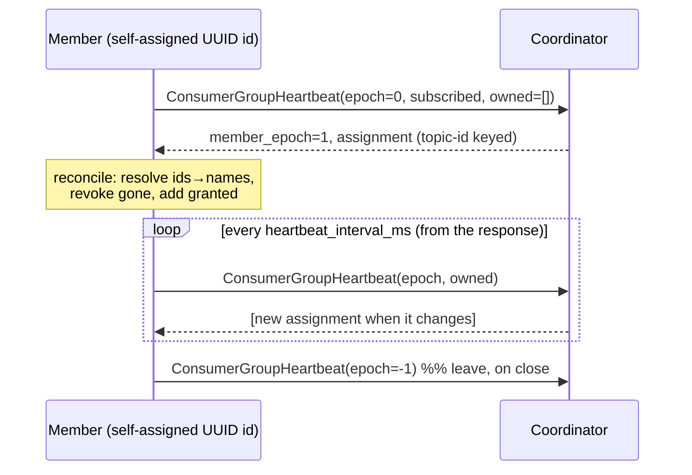

# Group membership & rebalancing

This is the consumer's correctness core. A consumer group spreads the partitions
of the subscribed topics across its members and keeps that division valid as
members come and go. The whole design exists to defend one invariant.

> **The invariant we defend**
>
> At any instant, **every partition of a subscribed topic is owned by at most one
> member of the group**, and in steady state by *exactly* one. A partition owned
> by two members at once means two consumers process the same records —
> double-processing. A partition owned by none means records pile up unconsumed.
> Every rebalance must move ownership from the old division to the new one
> **without ever transiently double-owning a partition.**

kacrab implements both Kafka group protocols behind the same `subscribe`/`poll`
surface, selected by `group.protocol`:

| | Classic (`classic`, default) | KIP-848 (`consumer`) |
|---|---|---|
| Assignment computed | client-side (elected leader) | server-side (coordinator) |
| Membership RPCs | `JoinGroup` + `SyncGroup` + `Heartbeat` | one `ConsumerGroupHeartbeat` |
| Member id | assigned by coordinator | generated by the client |
| Generation | `generation_id` | `member_epoch` |
| Assignment keyed by | topic name (`ConsumerProtocol` blob) | topic id |

## Finding the coordinator

Both protocols first locate the group's **coordinator** — the broker that owns
the group's slice of `__consumer_offsets` — with `FindCoordinator`. A freshly
started broker loads that log lazily, so the first lookups can answer
`COORDINATOR_NOT_AVAILABLE` / `COORDINATOR_LOAD_IN_PROGRESS`; kacrab retries with
backoff, like the Java client.

The coordinator is cached (`coordinator_id`). It can **move** — a broker restart
or a `__consumer_offsets` partition reassignment hands the group to a new broker.
When any operation then answers `NOT_COORDINATOR` / `COORDINATOR_NOT_AVAILABLE` /
`COORDINATOR_LOAD_IN_PROGRESS`, kacrab drops the cached id so the next call
re-discovers it; commits and the join/sync loop retry after re-finding. Without
this, a moved coordinator would fail every commit and rejoin permanently — a real
bug the review caught (see [Failure modes](../failure-modes.md)).

## The classic protocol

`JoinGroup` collects every member's subscription at the coordinator and elects
one member the **leader**. The leader — not the broker — runs the assignor and
returns each member's partitions in `SyncGroup`; the coordinator relays them. The
subscription and assignment travel as the version-prefixed `ConsumerProtocol`
blobs; kacrab caps the surrounding RPCs at name-keyed versions to sidestep the
topic-id strict codec.

A dedicated background task heartbeats on `heartbeat.interval.ms` independent of
poll cadence (Java's `HeartbeatThread`); a `REBALANCE_IN_PROGRESS` /
`ILLEGAL_GENERATION` / `UNKNOWN_MEMBER_ID` reply flags a rejoin that the next
`poll` performs.

### The assignors

The leader picks the assignor the whole group supports (from
`partition.assignment.strategy`) and runs it over `(member → subscribed topics)`
plus partition counts from metadata.

| Assignor | Algorithm |
|---|---|
| `range` | per topic, lay partitions over the subscribed members (sorted) as contiguous ranges; earlier members get the remainder |
| `roundrobin` | lay every `(topic, partition)` over the members in a circle, skipping members not subscribed to that topic |
| `sticky` | balanced greedy: each partition to the eligible member with the fewest so far |
| `cooperative-sticky` | sticky **plus** an incremental handoff — see below |

`range`/`roundrobin`/`sticky` rebalance **eagerly**: on any change every member
revokes everything and the new assignment is applied wholesale. Simple, but it
stops the world.

## Cooperative rebalancing (KIP-429)

`cooperative-sticky` keeps consuming through a rebalance and only moves the
partitions that actually change hands — while still never double-owning one. It
does this by making the assignor and the members cooperate over **two rounds**.

Two ingredients:

1. Each member reports the partitions it **currently owns** in its subscription
   blob (`ConsumerProtocol` v1).
2. The assignor computes a balanced sticky target, then **withholds** any target
   partition that another member still owns — it is only granted once its current
   owner has revoked it.

The client side of the handoff (`apply_assignment` with cooperative semantics):

- **Retained** partitions keep their live fetch position — they are never
  interrupted.
- **Revoked** partitions (owned but not in the new assignment) are dropped and a
  follow-up rejoin is triggered so the coordinator can hand them on.
- **Added** partitions resume from their committed offset.

A member *leaving* is cheaper: its partitions become unowned immediately, so the
survivors pick them up in a single round.

> **Why kacrab's sticky assignor withholds client-side**
>
> In the classic protocol there is no server arbiter of "who revoked what", so
> the *assignor* enforces the invariant: `cooperative_sticky_assign` computes the
> balanced target and then removes from each member's list any partition a
> *different* member still reports owning. The withheld partition reappears —
> unowned — only after its previous owner drops it and rejoins. Verified with two
> real consumers: they converge to a clean split with no partition ever in both
> assignments.

## KIP-848: server-side reconciliation

The next-generation protocol (`group.protocol=consumer`) moves assignment into
the coordinator and collapses membership into a single RPC.

The client generates its own member id (a UUID kept for the process lifetime),
joins at `member_epoch=0`, and reports its subscribed topics and currently owned
partitions on every heartbeat. The coordinator computes the target and sends the
member the partitions it may hold now.

> **The double-own invariant, now server-enforced**
>
> Reconciliation is *server-driven*: the coordinator **withholds** a partition
> from a member's target until the previous owner has revoked it (reported a
> reduced `owned` set in a heartbeat). So applying the received assignment
> directly — revoke what's gone, add what's granted — never double-owns a
> partition; the withholding that the client-side cooperative assignor does
> explicitly is done by the coordinator here. Revocation is reflected in the next
> heartbeat's `owned` set.

Assignments arrive **keyed by topic id**, resolved to names against cluster
metadata. Fencing (`FENCED_MEMBER_EPOCH` / `UNKNOWN_MEMBER_ID`) drops the
membership and rejoins from epoch 0. Because the heartbeat *is* the protocol, it
runs from `poll` at the interval the coordinator dictates.

## Static membership & clean shutdown

A `group.instance.id` makes the member **static**: it keeps its identity across a
restart, so a quick bounce does not trigger a rebalance (the coordinator waits
out the session). On `close`, a *dynamic* member leaves the group
(`LeaveGroup`, or a leaving heartbeat under KIP-848); a static member stays.
`close` is bounded by `request.timeout.ms` so a hung coordinator cannot hang it.

## What's verified

Against a real Apache Kafka 4.3.0 broker
([Verification](../verification.md)): a single subscriber owning both partitions;
two consumers splitting a topic and rebalancing to one each; the `roundrobin`
assignor; cooperative-sticky converging two consumers to a clean split; and a
`group.protocol=consumer` member joining via `ConsumerGroupHeartbeat`, being
assigned both partitions, consuming, and committing. The multi-member handoff is
exercised end to end for the classic cooperative path; the KIP-848 handoff relies
on the coordinator's documented server-side withholding.
