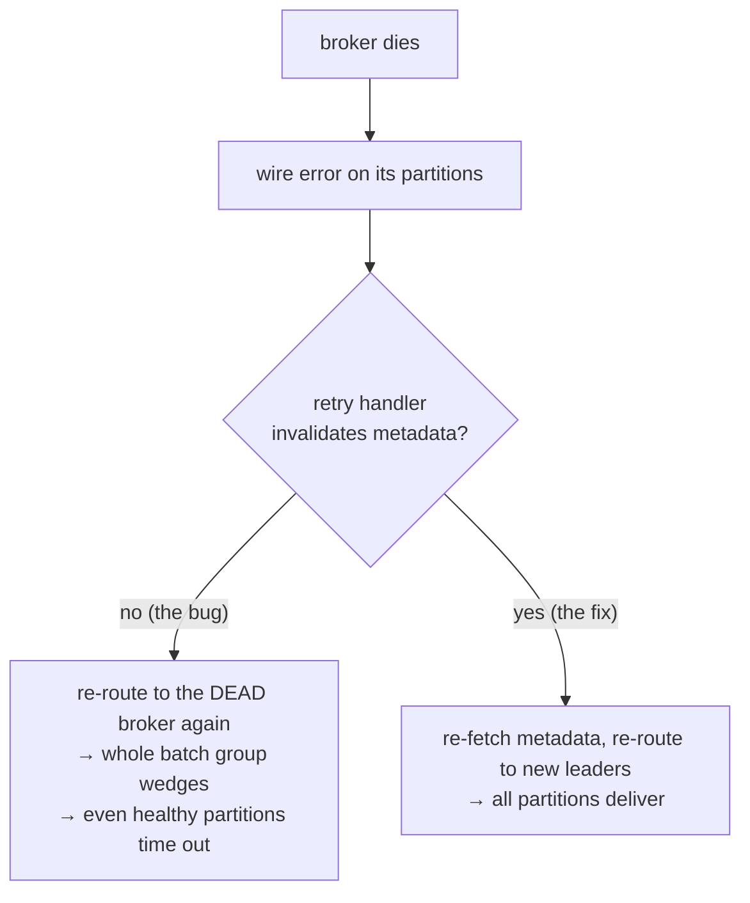

# When brokers die: failure modes

A client that works on a healthy cluster is a demo. A client you can run is
one that does the *right thing* when a broker dies mid-flight, a credential is
wrong, a leader moves under load, or a request is lost with no answer. This
chapter is the storm log of the journey — the catalogue of what went wrong (in
testing, on purpose, and once or twice by surprise) and what kacrab does about
each one now.

## Retryable vs fatal

The first decision on any error is whether retrying could possibly help. Getting
this wrong in either direction is a bug: retrying a fatal error wastes the whole
`request.timeout.ms` budget; failing fast on a transient one drops a recoverable
request.

| Error | Class | Action |
|---|---|---|
| `NOT_LEADER_FOR_PARTITION`, `LEADER_NOT_AVAILABLE` | retryable (definitive) | invalidate leader, re-route, retry **same** sequence |
| throttling, transient broker errors | retryable | back off, retry |
| connection reset / request timeout (no response) | retryable (**ambiguous**) | retry, and on final timeout bump the epoch |
| `MESSAGE_TOO_LARGE` | special | split the batch and requeue, or fail if unsplittable |
| `SaslAuthentication` / `SaslHandshake` / `TlsHandshake` | **fatal** | fail fast with the broker's reason |
| `InvalidSaslConfig` / `UnsupportedSaslMechanism` / `UnsupportedTlsOption` | **fatal** | fail fast |
| failed SCRAM server-signature | **fatal** | fail fast |

The fatal SASL/TLS rows are the ones that, before they were fixed, looped under
reconnect backoff until `request.timeout.ms` and surfaced as "request timed
out" — see [Security](./security.md).

## Ambiguous loss → epoch bump

The subtle one. A connection drops with no broker response: the records **may**
have been written. Blindly replaying risks a duplicate; not replaying risks a
drop. Kafka resolves it by **bumping the producer epoch**, fencing the old
in-flight state, and restarting sequences. kacrab bumps only on *ambiguous*
losses (no response) — a definitive rejection like `NotLeader` re-routes and
retries the same sequence, no bump. The full mechanism is in
[Idempotency & transactions](./producer/idempotency.md).

## Leadership change under load — the burst wedge

A real bug, found by [verifying against a 3-broker cluster](./verification.md):
a broker died while a burst of records to several partitions was in flight.

Because a dispatch retries its batch group as one unit, the partitions whose
leaders were *alive* wedged alongside the dead-broker ones — a 6-partition burst
went `0/6` (60 s timeout). The fix: a wire-failure retry now invalidates the
affected partitions before retrying, so the next attempt re-fetches metadata and
re-routes — mirroring Java's `NetworkClient` requesting a metadata update on
server disconnect. After it: `6/6`.

## Delivery timeout

`delivery.timeout.ms` is the hard ceiling on a record's lifetime across all
retries. When it expires, the delivery fails with a `DeliveryTimeout` naming the
batch that actually expired first (not an arbitrary one) — a small accuracy fix
that fell out of the same investigation.

## Back-pressure, not unbounded growth

Under load the producer applies back-pressure rather than buffering without
bound: `send` blocks up to `max.block.ms` when `buffer.memory` is exhausted, and
the wire pipeline rejects with `Backpressure` when every in-flight slot is full.
The goal is bounded memory under sustained overload — the property the
[production-acceptance soak](./benchmarks.md) is meant to confirm over hours.

## The consumer's storms

The consumer weathers its own set, each covered in depth in Part V:

- **A moved coordinator** (broker restart, `__consumer_offsets` reassignment)
  answers `NOT_COORDINATOR`; kacrab drops the cached coordinator and
  re-discovers it, retrying commits and rejoins — without this, every commit
  fails forever after a failover
  ([rebalancing](./consumer/rebalancing.md)).
- **An aged-out or out-of-range offset** is partition-local and routine:
  the one partition resets via `auto.offset.reset`, the rest of the poll
  keeps flowing ([fetching](./consumer/fetching.md)).
- **A truncated log after leader change** is detected with
  `OffsetForLeaderEpoch` and the position steps down to the divergence point
  instead of reading offsets that no longer exist (KIP-320).

## Field notes

- Every failure here maps to a time budget you own: `delivery.timeout.ms`
  for produced records, `max.block.ms` for buffer waits,
  `default.api.timeout.ms` for consumer/admin calls. Set them to your real
  freshness requirements — the [field guide](./field-guide/foundations.md)
  has the ladder.
- Back-pressure symptoms ("send is hanging!") usually mean the budget is
  working: the buffer is full because the cluster is slow. Fix the cluster
  or widen the buffer knowingly; don't reach for `max.block.ms=0` first.
- The burst-wedge above is the argument for *testing your own failover*:
  it only reproduces with multiple partitions, a mid-burst broker loss, and
  batching — no unit test finds it.
