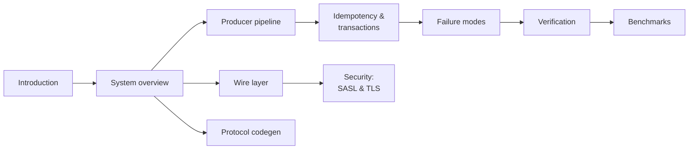

# kacrab — Design & Internals

> A Rust-native Apache Kafka client, built from the wire protocol up, that is
> *outcome-faithful* to the Java client without a JVM.

This book is the **why** and the **how** behind kacrab. The API docs on
[docs.rs](https://docs.rs/kacrab) tell you what each type does; this book tells
you how the producer pipeline, the idempotent state machine, the wire reactor,
and the SASL/TLS handshakes actually work — and why they are built the way they
are.

## What makes kacrab interesting

- **Java-faithful, not a Java port.** The idempotent/transactional producer
  reproduces the Java client's *real* algorithms — `inflightBatchesBySequence`
  ordering, `firstInFlightSequence` retry gating, `maybeResolveSequences` epoch
  handling, duplicate-sequence dedup — and is byte-exact on the things that must
  be byte-exact (murmur2 partitioning, CRC32C, varint/zigzag, record-batch v2).
  Where the runtime model differs (async tasks vs Java's single Sender thread),
  kacrab keeps the *outcomes* identical. See
  [Design decisions](./design-decisions.md).
- **No JVM tax.** On a single-node broker the producer holds throughput parity
  with the Java client at the default `acks=all` + idempotence config while
  using ~4× less memory and ~1.5× less CPU. See [Benchmarks](./benchmarks.md).
- **Generated, oracle-checked protocol.** Request/response types are generated
  from the upstream Kafka message schemas and checked against the Java client as
  an external oracle across six fixture families. See
  [Protocol code generation](./codegen.md).
- **Verified against real brokers, not just unit tests.** Every SASL mechanism
  (PLAIN, SCRAM-256/512, OAUTHBEARER, GSSAPI), every TLS mode (SSL, SASL_SSL,
  mutual TLS), every compression codec (gzip, snappy, lz4, zstd), and
  multi-broker leadership-change recovery are exercised end-to-end against real
  Apache Kafka. See [Verification](./verification.md).

## How to read this book

Start with [System overview](./overview.md) for the layer map, then dive into
whichever deep dive you came for. The two crown-jewel chapters are
[Idempotency & transactions](./producer/idempotency.md) (the producer's
correctness core) and [Security](./security.md) (the SASL/TLS handshakes,
including the parts most clients get subtly wrong).

> **Note**
>
> kacrab is pre-release. The public API and runtime behavior are not yet stable
> release guarantees. This book tracks `master`.
