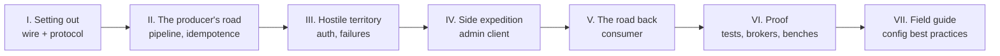

# The expedition brief

> A Rust-native Apache Kafka client, built from the wire protocol up, that is
> *outcome-faithful* to the Java client without a JVM.

Most client libraries are documented like museums: here is the API, here are
the exhibits, please don't touch the glass. This book is written as the
opposite — a travelogue. kacrab was built by walking the Kafka protocol from
the first `ApiVersions` byte to a full producer, admin client, and consumer,
and nearly everything interesting about it was *discovered on the way*: a
handshake round most clients skip, a missing metadata invalidation that wedged
an entire burst, a `localhost` that resolved to a dead IPv6 loopback, a
coverage tool that made correct code flake.

So each chapter is a leg of that journey. It tells you what we set out to
build, what the terrain actually looked like, what broke, what the broker
taught us — and which configuration lessons we packed for the next leg. The
API docs on [docs.rs](https://docs.rs/kacrab) tell you *what* each type does;
this book tells you *how* it works, *why* it is built that way, and *how to
configure it well*.

## What we brought home

- **A Java-faithful client that is not a Java port.** The idempotent producer
  reproduces the Java client's *real* algorithms — `inflightBatchesBySequence`
  ordering, `firstInFlightSequence` retry gating, `maybeResolveSequences`
  epoch handling — and is byte-exact where bytes are the contract (murmur2,
  CRC32C, varint/zigzag, record-batch v2). Where the runtime model differs
  (async tasks vs Java's single Sender thread), kacrab keeps the *outcomes*
  identical. See [Design decisions](./design-decisions.md).
- **A consumer at full Java feature parity.** Manual assignment, topic and
  pattern subscription, both group protocols (classic assignors including
  incremental `cooperative-sticky`, and the KIP-848 server-side protocol),
  incremental fetch sessions (KIP-227), topic-id fetches (KIP-516), and
  truncation detection (KIP-320). See [The consumer client](./consumer.md).
- **No JVM tax — measured, not asserted.** At identical default configs
  against the same native broker, the producer is ~25–28% faster than Java's
  own perf tool at ~4× less memory; the consumer reads 1.9–4× faster at
  ~16–20× less memory. See [Benchmarks](./benchmarks.md).
- **A generated, oracle-checked protocol.** Request/response types are
  generated from the upstream Kafka schemas and cross-checked against the Java
  client as an external oracle. See [Protocol codegen](./codegen.md).
- **Verified against real brokers, not just against itself.** Every SASL
  mechanism, every TLS mode, every compression codec, multi-broker failover,
  and every admin operation ran end-to-end against real Apache Kafka 4.3.0.
  See [Verification](./verification.md).

## The route

The parts of this book follow the order the client was actually built — each
leg stands on the previous one.

- **Part I — Setting out.** Before anything can be produced or consumed, bytes
  must reach a broker and come back: the [wire layer](./wire.md) and the
  [generated protocol](./codegen.md) it speaks.
- **Part II — The producer's road.** One record, followed from `send()` to a
  broker acknowledgement: the [pipeline](./producer/pipeline.md),
  [partitioning](./producer/partitioning.md), the
  [idempotent state machine](./producer/idempotency.md) — the client's
  correctness core — and [compression](./compression.md).
- **Part III — Hostile territory.** The parts of the map marked "here be
  dragons": [SASL & TLS handshakes](./security.md) (including the rounds most
  clients get subtly wrong) and the [failure catalogue](./failure-modes.md).
- **Part IV — A side expedition.** The [admin client](./admin.md): 62
  operations and the four routing patterns that carry them.
- **Part V — The road back.** Everything we wrote, read back in order: the
  [consumer](./consumer.md), [group rebalancing](./consumer/rebalancing.md),
  and [fetching & offsets](./consumer/fetching.md).
- **Part VI — Proof.** How we know any of the above is true:
  [testing & CI](./testing-and-ci.md),
  [real-broker verification](./verification.md), and
  [benchmarks](./benchmarks.md).
- **Part VII — The field guide.** The distilled configuration best practices —
  [foundations](./field-guide/foundations.md),
  [producer tuning](./field-guide/producer.md), and
  [consumer tuning](./field-guide/consumer.md). If you came here to *run*
  kacrab rather than to study it, you can start there and follow the links
  back into the deep dives.

## How to read this book

Read Parts I–VI in order if you want the journey; jump straight to Part VII
if you want the destination. The two crown-jewel deep dives are
[Idempotency & transactions](./producer/idempotency.md) and
[Security](./security.md) — both are self-contained.

> **Status**
>
> kacrab `0.1.0` is published on [crates.io](https://crates.io/crates/kacrab)
> (producer, consumer, and admin surfaces). Pre-1.0, the public API can still
> change between minor versions; this book tracks `master`. Kafka Streams and
> share groups are separate products and not part of this client.
