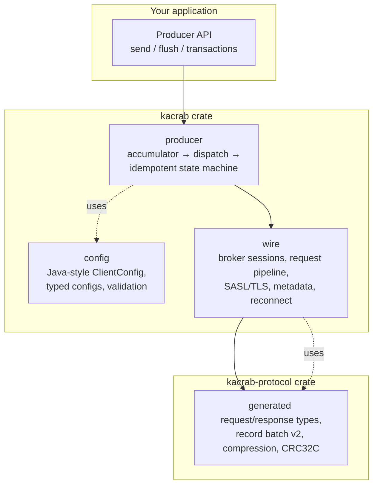

# System overview

kacrab is three layers, each a crate or module with a sharp boundary.

- **`config`** — the Kafka property surface (`bootstrap.servers`, `acks`,
  `compression.type`, `sasl.*`, `ssl.*`, …) with typed parsing and validation.
  Generated from official Kafka config metadata. See
  [Protocol code generation](./codegen.md).
- **`wire`** — the async transport: per-broker Tokio sessions, a bounded
  in-flight request pipeline, the SASL/TLS handshakes, metadata fetch +
  leader-change invalidation, and a reconnect/backoff policy. See
  [The wire layer](./wire.md) and [Security](./security.md).
- **`producer`** — batching accumulator, the dispatch path that groups batches
  per broker leader, and the idempotent/transactional state machine. See
  [The producer pipeline](./producer/pipeline.md) and
  [Idempotency & transactions](./producer/idempotency.md).
- **`kacrab-protocol`** — the generated wire types, record-batch v2 encode/decode,
  compression codecs, and CRC32C. Zero hand-written byte patching.

The consumer, admin, and streams surfaces are not implemented yet; the wire and
protocol foundations they will sit on already exist.
