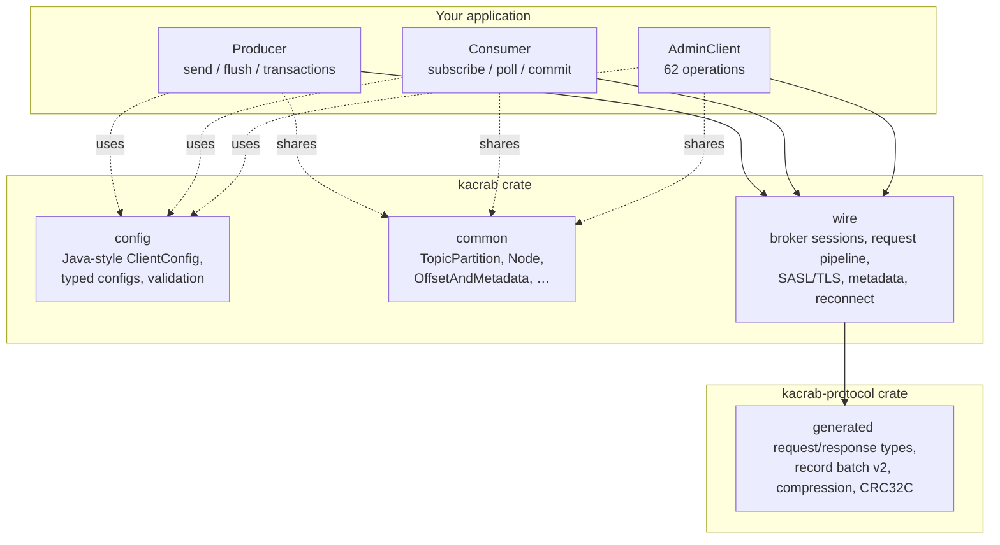

# The map

Every expedition starts with a map. kacrab's territory is small on purpose:
three client surfaces sharing one transport, one config system, and one
generated protocol — each layer a crate or module with a sharp boundary.


```mermaid
flowchart TB
  subgraph app[Your application]
    P["Producer<br/>send / flush / transactions"]
    K["Consumer<br/>subscribe / poll / commit"]
    AD["AdminClient<br/>62 operations"]
  end
  subgraph kacrab[kacrab crate]
    CFG["config<br/>Java-style ClientConfig,<br/>typed configs, validation"]
    COM["common<br/>TopicPartition, Node,<br/>OffsetAndMetadata, …"]
    WIRE["wire<br/>broker sessions, request pipeline,<br/>SASL/TLS, metadata, reconnect"]
  end
  subgraph proto[kacrab-protocol crate]
    GEN["generated request/response types,<br/>record batch v2, compression, CRC32C"]
  end
  P --> WIRE
  K --> WIRE
  AD --> WIRE
  WIRE --> GEN
  P -.uses.-> CFG
  K -.uses.-> CFG
  AD -.uses.-> CFG
  P -.shares.-> COM
  K -.shares.-> COM
  AD -.shares.-> COM
```

## The regions

- **`config`** — the Kafka property surface (`bootstrap.servers`, `acks`,
  `group.id`, `compression.type`, `sasl.*`, `ssl.*`, …) with typed parsing and
  validation, generated from official Kafka config metadata and drift-checked
  against it. The [field guide](./field-guide/foundations.md) is the practical
  tour of this surface.
- **`wire`** — the async transport every client rides: per-broker Tokio
  sessions, a bounded in-flight request pipeline, the SASL/TLS handshakes,
  metadata fetch + leader-change invalidation, and reconnect/backoff. See
  [First contact](./wire.md) and [Security](./security.md).
- **`common`** — shared `org.apache.kafka.common` domain types
  (`TopicPartition`, `OffsetAndMetadata`, `Node`, …), always compiled and
  re-exported by every surface, so a `TopicPartition` is the same type
  whether a producer, consumer, or admin call hands it to you.
- **`producer`** — batching accumulator, the dispatch path that groups batches
  per broker leader, and the idempotent/transactional state machine. See
  [Following one record](./producer/pipeline.md) and
  [Exactly once](./producer/idempotency.md).
- **`consumer`** — manual assignment and group subscription over both group
  protocols, the fetch/position/offset state machines, and incremental fetch
  sessions. See [The consumer client](./consumer.md).
- **`admin`** — the full Apache Kafka 4.3.0 `Admin` operation surface with
  controller/coordinator/per-leader/broadcast routing. See
  [The admin client](./admin.md).
- **`kacrab-protocol`** — the generated wire types, record-batch v2
  encode/decode, compression codecs, and CRC32C. Zero hand-written byte
  patching. See [Learning the language](./codegen.md).

## The parts left blank

Kafka Streams is deliberately outside this map — it is a separate product built
*on* clients, not a client surface. Everything a Kafka 4.3 *client* does —
produce, consume, administer, authenticate — is implemented, including the
KIP-932 share consumer (share groups, the queue-shaped consuming surface) behind
the `share-consumer` feature.

## Choosing your provisions

Every surface is a Cargo feature and `default = []`, so you enable exactly
what you use:

```toml
[dependencies]
kacrab = { version = "0.3", features = ["producer", "consumer", "admin", "aws-lc-rs-tls"] }
```

`consumer` pulls in the `compression` meta-feature (fetched batches must be
decodable regardless of what the producer chose).

**TLS needs a crypto provider named explicitly.** `aws-lc-rs-tls` is the default
provider and what CI exercises; `pure-rust-tls` puts `rustls` on `ring` and keeps
`aws-lc-sys` out of the dependency tree entirely. You need one of them for `SSL`
or `SASL_SSL`; a `PLAINTEXT`-only build can name neither and then compiles no
crypto backend at all. Enabling both is well defined — `aws-lc-rs` wins.

`zstd` and `lz4-hc` compile C code; a pure-Rust build is possible — the
trade-offs are in
[Traveling light](./compression.md) and the
[field guide](./field-guide/foundations.md#start-with-the-features).
