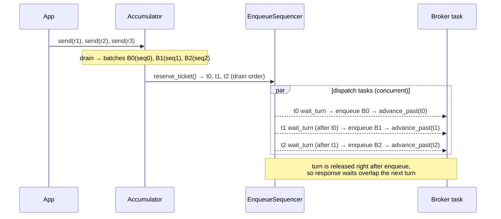
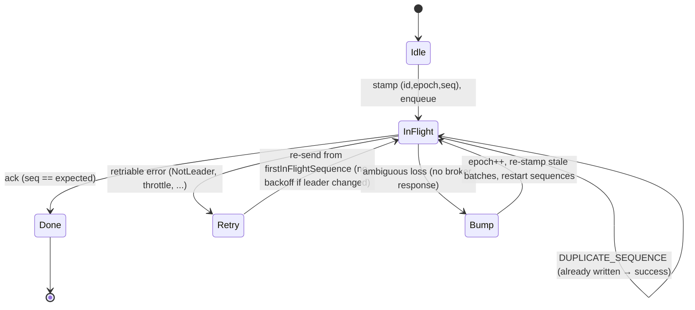

# Exactly once, even when the network lies

This is the hardest leg of the producer's road, and the one the rest of the
journey was planned around. The promise of an idempotent producer is simple to
state and brutal to keep: **every record is written to the log exactly once
and in order, even across retries, reconnects, and broker failovers** — even
when the network swallows a response and refuses to say whether the write
landed. Kafka delivers this with a `(producer id, epoch, base sequence)`
triple stamped on every record batch, and a per-partition state machine on
both the client and the broker. kacrab reproduces that state machine — the
*real* one, from the Java client's source, not a simplified sketch.

> **The invariant we defend**
>
> For each partition, the broker accepts batches whose `base sequence` is exactly
> the next expected sequence. A gap → `OUT_OF_ORDER_SEQUENCE_NUMBER`. A repeat →
> silently deduplicated (`DUPLICATE_SEQUENCE_NUMBER`, treated as success). So the
> client must guarantee that the sequence numbers it puts *on the wire*, per
> partition, are a strictly ascending, gap-free run — **even when multiple
> requests are in flight and some of them are retried.**

## The pieces of state

Per partition the producer tracks, mirroring Java's `TransactionManager`:

- **`nextSequence`** — the sequence to stamp on the next *new* batch.
- **`inflightBatchesBySequence`** — batches sent but not yet acknowledged,
  ordered by base sequence. This is what lets us keep several requests in flight
  per partition without losing the order on retry.
- **`firstInFlightSequence`** — the base sequence of the oldest unacked batch;
  the retry gate.
- **producer `(id, epoch)`** — bumped to fence stale state after an ambiguous
  failure.

## Multiple in flight, still in order

With `max.in.flight.requests.per.connection = 5`, five ProduceRequests for the
same partition can be on the wire at once. The Java client guarantees their
*enqueue* order with a single Sender thread. kacrab has no Sender thread — it
dispatches on concurrent Tokio tasks — so it reconstructs that ordering with an
explicit ticket sequencer.

The key subtlety: a dispatch **advances the turn as soon as its request is
enqueued on the socket**, *not* after the response comes back. So the broker
observes ascending base sequences per partition (the ordering guarantee), while
the response waits still run concurrently (the throughput we want). A retry that
reuses its ticket returns from `wait_turn` immediately, so retries never deadlock
behind newer tickets.

## Retry without reordering

When a batch fails retriably (e.g. `NOT_LEADER_FOR_PARTITION`), it must be
re-sent **before** any batch with a higher sequence — otherwise the broker sees
a gap. The `firstInFlightSequence` gate enforces this: a partition only re-sends
starting from its oldest unacked sequence, and newer in-flight batches for that
partition wait behind it.

## When to fence: the epoch bump

The dangerous case is an **ambiguous loss** — the connection drops with no
broker response, so the client cannot know whether the batch was written. Replaying
it blindly could duplicate; not replaying could drop. Kafka resolves this by
**bumping the producer epoch**, which fences all old in-flight state, and
restarting sequences for the partition.

kacrab distinguishes the two failure shapes precisely:

| Failure | Example | Epoch bump? |
|---|---|---|
| **Ambiguous** (no response) | connection reset, request timeout | **Yes** — records may have been written |
| **Definitive** (broker said no) | `NOT_LEADER_FOR_PARTITION` | No — re-route and retry the same sequence |

`maybeResolveSequences` defers the bump until the partition has no in-flight
batches (the `hasInflightBatches` gate) so a bump can't race a sibling request.

> **The concurrent-task adaptation**
>
> Java renumbers a partition's in-flight batches in place because its single
> Sender thread owns them all. kacrab's dispatch tasks each own their own batches
> and can't reach into a sibling's, so it can't renumber them in place. Instead a
> bump performs a **global epoch reset**: the epoch advances, every partition's
> sequences restart, and any batch stamped under the now-stale epoch is
> **re-stamped on its next prepare** (it is detected as stale and re-enqueued).
> The on-the-wire outcome is identical to Java's `startSequencesAtBeginning` — the
> broker sees a fresh epoch with sequences from zero — but the mechanism fits the
> concurrent model. See the audit notes in
> [Design decisions](../design-decisions.md).

## A failure that *looked* fixed but wasn't

A real bug found by [verifying against a 3-broker cluster](../verification.md):
when a broker died mid-burst, a wire/connection error retry did **not** invalidate
the stale leader metadata. The retry kept routing the affected partitions to the
dead broker until the delivery timeout — and because a dispatch retries its whole
batch group as one unit, the *healthy* partitions batched alongside them wedged
too (every delivery timed out, not just the affected ones).

The fix: a wire-failure retry now invalidates the affected partitions before
retrying, so the next attempt re-fetches metadata and re-routes to the new
leaders — mirroring Java's `NetworkClient` requesting a metadata update on server
disconnect. A 6-partition burst across a broker loss went from `0/6` (60 s
timeout) to `6/6`. See [Failure modes](../failure-modes.md).

## Transactions

Transactions layer onto the idempotent core: a `transactional.id` gets a fenced
producer id via `InitProducerId`, partitions are registered with
`AddPartitionsToTxn` before their first write, consumer offsets commit through
`TxnOffsetCommit`, and the transaction ends with `EndTxn` (commit or abort)
routed through the transaction coordinator (found via `FindCoordinator`). The
control flow is a state machine over those requests; the data-plane sequencing is
exactly the idempotent machine above, with the transactional id and epoch added
to each batch.

> **Tip**
>
> The whole transactional path was smoke-tested against a real broker
> (`InitProducerId` → `begin` → `send` → `commit` → delivery receipt). See the
> `real_kafka_producer` test in [Verification](../verification.md).

## Field notes

Everything in this chapter runs at the **default** config — that is the point:

- `enable.idempotence=true` and `acks=all` are the defaults; leave them.
  Turning idempotence off to "save overhead" forfeits both dedup *and*
  ordering under retry, for a few bytes per batch.
- `max.in.flight.requests.per.connection ≤ 5` is the ceiling under which the
  sequencing above holds; 5 is the default and the sweet spot.
- Bound retries with `delivery.timeout.ms`, not `retries` — the state machine
  makes retries safe, so let time be the budget.
- `transactional.id`: stable per logical producer, unique per instance —
  sharing one across two live producers triggers fencing *by design*.

The [producer field guide](../field-guide/producer.md) puts these in context.
