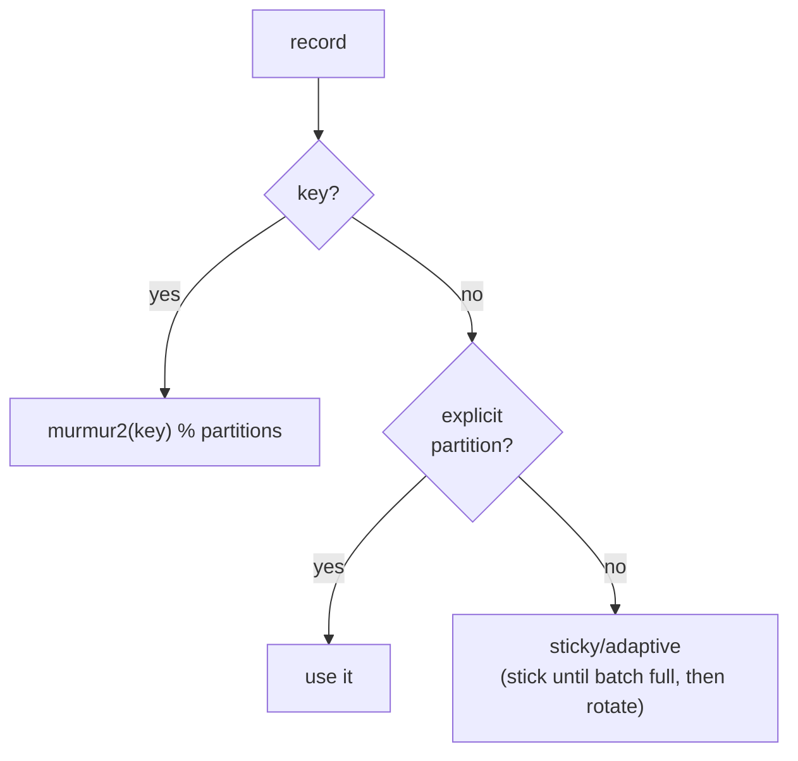

# Partitioning

Every record needs a partition. kacrab chooses it exactly as the Java client
does — which matters more than it sounds: a different choice means a different
key→partition mapping, which breaks ordering guarantees and consumer
expectations for anyone running both clients against the same topic.

## Keyed records: murmur2, byte-exact

When a record has a key, the partition is

```text
(murmur2(key_bytes) & 0x7fffffff) % num_partitions
```

kacrab's murmur2 is **byte-exact with Kafka's** for every key length — the same
seed, the same tail handling, the same masking — verified directly against the
Java implementation. Same key → same partition → same per-key order, whether the
producer is kacrab or Java.

## Null-key records: sticky / adaptive

With no key, partitioning by round-robin per record would scatter a batch across
every partition and defeat batching. Kafka's `BuiltInPartitioner` instead is
**sticky**: it picks one partition and keeps using it until the current batch
fills, then rotates. kacrab mirrors this, and the **adaptive** variant weights
each rotation by the partitions' *live* accumulator queue depths (a shorter
queue gets more traffic; a slow/unavailable leader gets less), matching Kafka's
`partitioner.adaptive.partitioning.enable` and
`partitioner.availability.timeout.ms`.

The queue depths are **re-sampled from the accumulator at every sticky
rotation** — on the synchronous send path as well as the awaiting one, mirroring
Java's sender refreshing `partitionLoadStats` on every `RecordAccumulator.ready()`
pass. This freshness is load-bearing, not a nicety: rotating on a frozen
snapshot locks in whatever weighting the last refresh saw, the favored partition
keeps absorbing most new batches, its queue serializes dispatch, and the
imbalance never self-corrects (observed as a 62/31/8 split across three
partitions that halved large-record throughput).



## Explicit partition

`ProducerRecord::new(topic, partition)` targets a partition directly and bypasses
the partitioner entirely — used by the multi-broker tests to drive specific
leaders.

## Custom partitioners

The `ProducerPartitioner` trait is the extension point:

```rust
pub trait ProducerPartitioner: Send + Sync + 'static {
    fn partition(&self, record: &ProducerRecord, metadata: &ClusterMetadata) -> Result<i32>;
}
```

`RoundRobinPartitioner` ships as a built-in (mirroring Kafka's
`RoundRobinPartitioner`), and you can supply your own for custom routing.

> **The point of byte-exactness**
>
> Partitioning is one of the handful of things that must be *byte-for-byte*
> identical to Java, not just "compatible". kacrab treats murmur2, CRC32C, and the
> varint/zigzag encodings as that kind of contract — tested against the Java
> output, not just against themselves.
