# The producer pipeline

This chapter follows a record from `producer.send(record)` to bytes on a socket.
The [idempotency chapter](./idempotency.md) covers the sequencing; this one
covers the path.

```mermaid
flowchart LR
  A["send(record)"] --> B["partition assignment"]
  B --> C["accumulator<br/>(per-topic-partition batches)"]
  C -- drain ready --> D["prepare<br/>(idempotent sequences)"]
  D --> E["dispatch:<br/>group by broker leader"]
  E --> F["split on max.request.size"]
  F --> G["EnqueueSequencer<br/>(ordered enqueue)"]
  G --> H["wire → broker"]
  H -- ack --> I["RecordMetadata receipt"]
```



## `send` is synchronous

kacrab matches the Java `Producer.send` shape: `send` is a plain `fn`, not an
`async fn`. It assigns the partition, appends to the accumulator, and returns a
`SendFuture` you await for the broker acknowledgement.

```rust
let delivery = producer.send(ProducerRecord::new("orders", 0).value(v))?; // sync
let receipt  = delivery.await?;                                           // ack
```

This is deliberate: the append is a cheap, non-blocking, in-memory operation
(until `buffer.memory` is exhausted, at which point it blocks up to
`max.block.ms`), exactly like Java. Deferring the dispatch lets the accumulator
coalesce many `send`s into a few Produce requests.

## The accumulator

Records are batched per topic-partition. `AccumulatorConfig` controls the knobs:

- **`batch.size`** — the soft cap on bytes per partition batch.
- **`linger.ms`** — how long a partial batch waits for more records before it is
  eligible to drain (zero by default).
- **`buffer.memory`** + **`max.block.ms`** — the total memory the unsent records
  may occupy, and how long `send` blocks when that memory is full.

A background sender drains *ready* batches (full, or past their linger deadline),
prepares them, and dispatches.

## Drain → prepare → dispatch

1. **Drain** pulls ready batches out of the accumulator in a single sequential
   pass — the point where idempotent sequence numbers are assigned in order.
   The idempotent path drains only each partition's *front* batch per cycle:
   dispatch starts at most one new request per partition per selection, so
   draining a deep backlog only to re-enqueue all but one batch per partition
   would be O(backlog) churn under the accumulator lock on every cycle.
   Non-idempotent dispatch drains everything ready (it coalesces all of it into
   one request).
2. **Prepare** stamps each batch with its `(producer id, epoch, base sequence)`
   and registers it in the partition's in-flight set. Batches that cannot be sent
   in order yet are deferred (re-enqueued). A cycle whose every ready batch is
   deferred (all partitions already at the in-flight depth cap) parks the sender
   until a completion frees a slot — re-polling immediately would livelock in a
   hot drain/defer/requeue spin for the whole round trip.
3. **Dispatch** routes each batch to its partition leader, groups batches
   destined for the same broker into one Produce request, splits on
   `max.request.size`, and enqueues through the
   [`EnqueueSequencer`](./idempotency.md) so the broker sees ascending base
   sequences per partition. Responses are awaited concurrently.

> **Why group by broker**
>
> A partition has one leader; many partitions can share a leader. Grouping by
> leader turns N partition batches into one request per broker — fewer round
> trips, and the per-broker coalescing already saturates a low-RTT connection.

## Delivery, flush, close

- Each batch yields a `RecordMetadata` (topic, partition, offset, timestamp,
  serialized sizes) delivered through the `SendFuture` or a
  `send_with_callback` callback.
- **`flush`** waits for all buffered + in-flight records to complete.
- **`close`** flushes then shuts the producer down (`close_now` for an immediate
  drop; `close_timeout` bounds the wait).

## Interceptors & metrics

The producer runs the full Kafka `ProducerInterceptor` lifecycle
(`configure` / `on_send` / `on_acknowledgement` / `close`, plus the
`ClusterResourceListener.onUpdate` hook) and publishes metrics under their Kafka
names (`producer-metrics:*` / `producer-topic-metrics:*`), including the
buffer-pool gauges.
