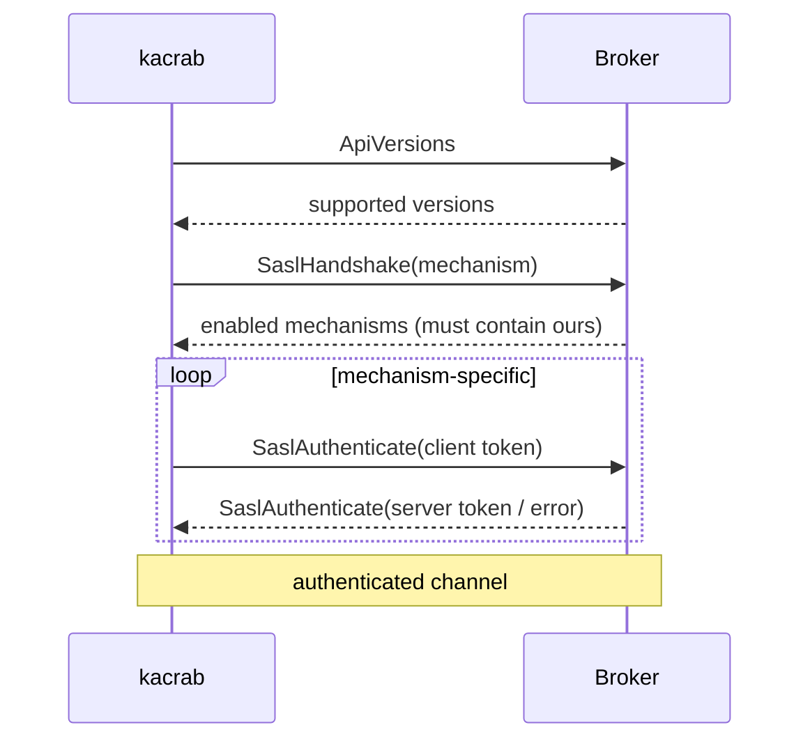
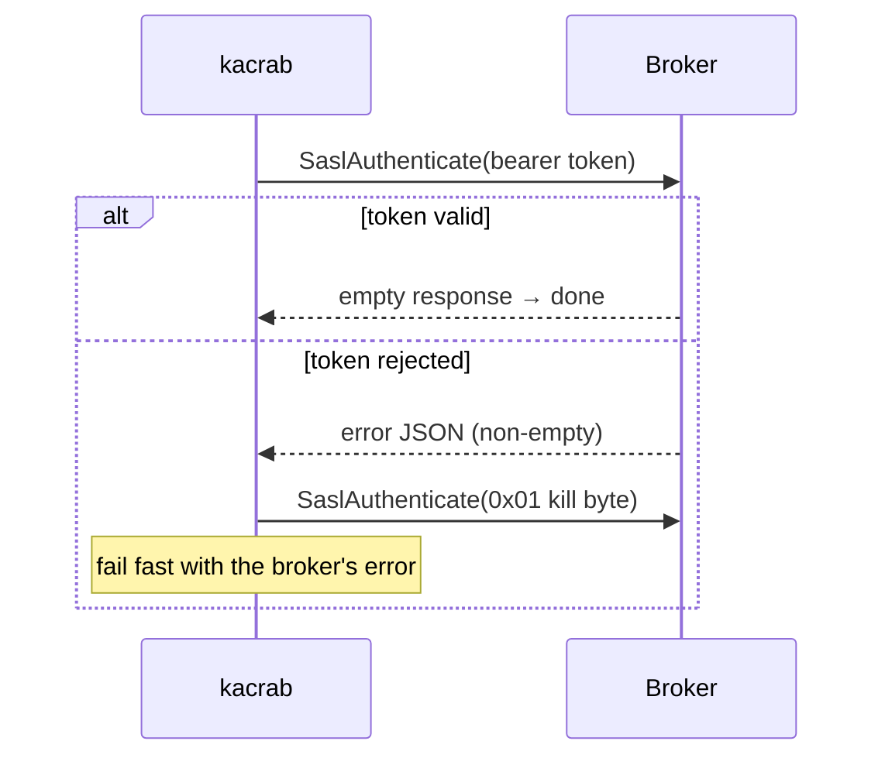
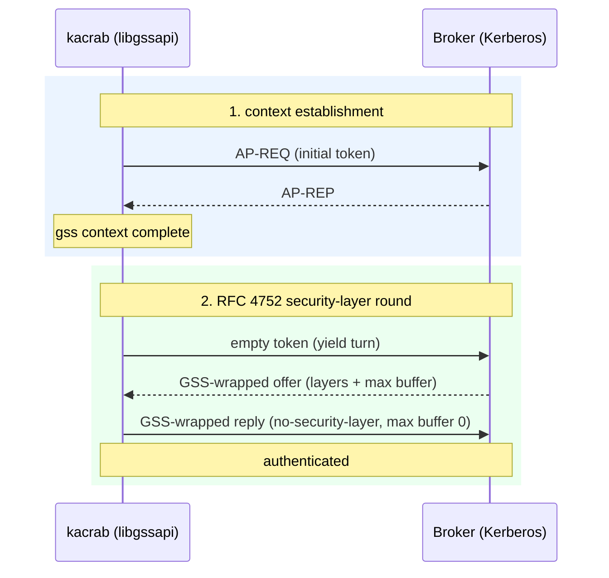

# Security: SASL & TLS

kacrab speaks every authentication mechanism the Java client does, over plain
TCP or TLS. This chapter covers the handshakes — including the parts that are
easy to get *almost* right, which is the same as getting wrong. Every path here
is [verified end-to-end against real brokers](./verification.md).

`security.protocol` selects the combination:

| `security.protocol` | Transport | Auth |
|---|---|---|
| `PLAINTEXT` | TCP | none |
| `SSL` | TLS | none (or mutual TLS) |
| `SASL_PLAINTEXT` | TCP | SASL |
| `SASL_SSL` | TLS | SASL |

## The SASL handshake

Every SASL mechanism rides the same two-request envelope, negotiated *after* an
`ApiVersions` exchange:

What varies is the token exchange inside the loop.

- **PLAIN** — one round: `\0username\0password`.
- **SCRAM-SHA-256 / -512** — two rounds: client-first → server-first
  (salt+iterations) → client-final (proof) → server-final (verifier). kacrab
  verifies the server signature, so a man-in-the-middle that can't prove the
  shared secret is rejected.
- **OAUTHBEARER** — token-based, with an error subtlety (below).
- **GSSAPI** — Kerberos, with a security-layer round most home-grown clients
  miss (below).

> **Fail fast, don't retry an auth failure**
>
> A *rejected credential* is not a transient error. Early on, kacrab classified a
> SASL/TLS failure as retryable, so a wrong password looped under reconnect backoff
> until `request.timeout.ms` and surfaced as "request timed out" 30 seconds later.
> Now `SaslAuthentication`, `SaslHandshake`, `TlsHandshake`, and a failed
> server-signature check are **fatal setup errors** — they fail fast with the
> broker's real reason ("Invalid username or password", "invalid peer certificate:
> UnknownIssuer"), matching Java's non-retriable `SaslAuthenticationException` /
> `SslAuthenticationException`.

## OAUTHBEARER: the error round you can't skip

On a *valid* token the broker returns an empty server response and auth is done.
On a *rejected* token (e.g. expired), RFC 7628 says the server returns an error
challenge (a JSON blob like `{"status":"invalid_token"}`) and waits for the
client to send a single `0x01` "kill" byte before failing.

A naive client does one round, sees no Kafka-level error code, assumes success,
and sends its first application request — at which point the broker, still
mid-authentication, rejects it with `ILLEGAL_SASL_STATE`. kacrab completes the
RFC 7628 error round instead:

## GSSAPI: the security-layer round most clients miss

Kerberos is the trickiest. After `gss_init_sec_context` establishes the security
context, **the exchange is not over** — RFC 4752 requires one more round: the
server sends a GSS-wrapped offer (a bitmask of supported security layers + a max
buffer size), and the client must unwrap it, choose a layer, and send back a
wrapped reply. Skip it and the broker stays mid-authentication and rejects the
next request with `ILLEGAL_SASL_STATE` — exactly the OAUTHBEARER trap, in a
different costume.

kacrab models this as an explicit `Establishing → SecurityLayer → Done` state
machine over `libgssapi`, selecting "no security layer" (Kafka runs its own
transport), exactly as the JDK's `GssKrb5Client` does.

## TLS

The transport side is `rustls` (with `aws-lc-rs`). Trust and identity material
loads from PEM (inline or file), JKS, or PKCS12 — the same `ssl.truststore.*` /
`ssl.keystore.*` keys as the Java client.

- **Server auth** verifies the broker certificate against the configured trust
  anchors (plus OS roots).
- **`ssl.endpoint.identification.algorithm`** — `https` (default) checks the
  certificate SAN against the broker hostname; empty skips the hostname check but
  still verifies the chain.
- **Mutual TLS** — supply a client certificate/key (`ssl.keystore.*`) and the
  broker authenticates the client too.

> **What "verified" means here**
>
> Not "the unit tests pass" — every mechanism above was run against real Apache
> Kafka 4.3.0: PLAIN/SCRAM/OAUTHBEARER over plaintext and TLS, GSSAPI against a
> real MIT Kerberos KDC, and one-way + mutual TLS, each authenticating and running
> `ApiVersions`, with negative cases (bad credentials, expired token, untrusted
> cert) confirming rejection is fast and clear. See [Verification](./verification.md).
