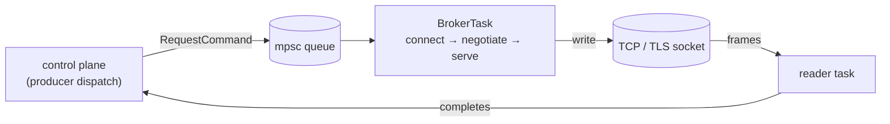

# The wire layer

The `wire` module is the async transport every higher layer rides on. Its job:
turn a stream of "send this request to broker N" commands into bytes on a socket
and responses back to the caller — correctly, with bounded memory, surviving
reconnects and broker failovers. It is built on Tokio and `rustls`, with no
`librdkafka` and no C client bindings.

## One task per broker

Each broker connection is owned by its own Tokio task (`BrokerTask`), fed by an
mpsc command queue. The control plane holds a cheap `BrokerHandle` (a `Clone`
sender) and never touches the socket directly.

On connect the task runs a synchronous capability exchange — `ApiVersions`
(v3, with client software name/version so the broker logs kacrab's identity) and,
if `security.protocol` requires it, the [SASL/TLS handshake](./security.md) —
before the request pipeline opens. The negotiated `BrokerCapabilities` are
cached and shared so the control plane can gate behavior on what the broker
supports (for example, the coordinator's `InitProducerId` version).

## The request pipeline: fixed-slot, no per-request map

Up to `max.in.flight.requests.per.connection` requests are on the wire at once.
Correlating responses to waiters is the hot path, so kacrab does **not** use a
per-request hashmap — it uses a fixed-slot ring (`RequestPipeline` holds
`slots: Vec<Option<InFlightRequest>>`). A request takes the next slot, its
correlation id encodes the slot, and the response lands back in O(1) with no
allocation or hashing per request.

> **Back-pressure**
>
> When every slot is full, new commands wait (or are rejected with
> `Backpressure`) rather than growing an unbounded queue.

## Reader / writer split

The socket is split: a writer half on the task, a reader half on a dedicated
reader task.

- **Writer** — request frames are coalesced through a `BufWriter`, so a burst of
  small requests becomes few `write` syscalls instead of one per request.
- **Reader** — the reader task parses length-delimited response frames and
  **completes the waiting request directly**, instead of hopping the frame back
  to the main task first. One fewer hand-off on every response.

## Metadata & leadership

The wire layer fetches cluster/topic metadata, caches it, and **invalidates it on
a leader change** so the next request re-routes. Two triggers matter:

- A broker *response* carrying a `NotLeader` error or a current-leader update →
  apply the new leader.
- A *connection drop* (the broker went away) → invalidate the affected
  partitions so the retry re-fetches fresh leaders. This second case is the one
  that, when missing, caused the [burst-wedge bug](./failure-modes.md).

A configurable metadata-recovery strategy (rebootstrap) handles the case where
all known brokers become unreachable.

## Reconnect & backoff

When a connection fails to establish, the broker loop backs off and retries —
**exponential backoff with jitter**, reset to the initial delay on a successful
connection — while honoring each pending command's request timeout. But not
every failure should be retried:

| Setup failure | Behavior |
|---|---|
| TCP connect refused, transient | back off + retry |
| `SaslAuthentication` / `SaslHandshake` / `TlsHandshake` | **fatal — fail fast** |
| `InvalidSaslConfig` / `UnsupportedSaslMechanism` / `UnsupportedTlsOption` | **fatal — fail fast** |
| failed SCRAM server-signature check | **fatal — fail fast** |

The fatal cases mirror Java's non-retriable `SaslAuthenticationException` /
`SslAuthenticationException`: a wrong password or an untrusted certificate fails
immediately with the broker's reason, instead of looping until
`request.timeout.ms`. See [Security](./security.md) and
[Failure modes](./failure-modes.md).
